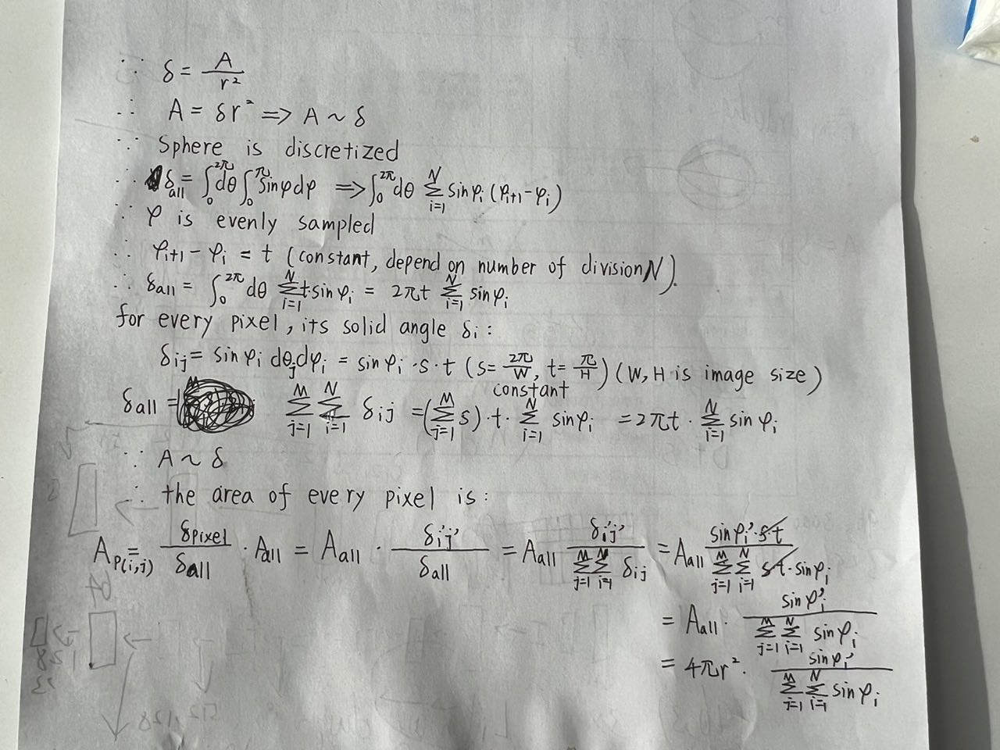

# Codes Usage
## pytorch


## numpy


## general
* get the shape of dimension 0 whatever it is tensor or ndarray
  ``` python
  len(a)  # a: [batch, m, n]
  ```
* get options
  1. use **configargparse**: generate .txt files. (source: NeRF-run_nerf.py)
     file format:
     ``` txt
     a = 100
     b = 1000 
     ``` 
     * usage
     ``` python
     import configargparse
     parser = configargparse.ArgumentParser()
     parser.add_argument('--config', is_config_file=True,help='config file path')

     parser = config_parser()
     args = parser.parse_args()
     ```
     ``` python
     python run_nerf.py --config path(./../lego.txt)
     ```
     * advantage: can edit options in shell by calling "--" or "-"
     * limitation: all the options should be defined at argparse first. 
  2. use **pyhocon.ConfigFactory**: generate .conf files. (source: invrender)
     file format: 
     ``` conf
     train{
        exp = ''
        n = 100
        out = [1, 2, 3, 4]
     }

     test{
        exp = ''
        key{
           alpha = 1.455
        }
     }
     ```
     * usage: 
       ``` python
       from pyhocon import ConfigFactory
       args = ConfigFactory.parse_file(path)
       n = args.get_int('train.n')
       exp = args.get_string('train.exp')
       alpha = args.get_float('test.key.alpha')
       out = args.get_list('train.out')
       ```
     * limitation: Everytime need the *get_{int or float}*
     * 

---

## code example
1. spherical env map与3D coordinate之间的转换
 ```python
def gen_light_xyz(envmap_h, envmap_w, envmap_radius=1e2):
    """Additionally returns the associated solid angles, for integration.
    """
    # OpenEXR "latlong" format
    # lat = pi/2
    # lng = pi
    #     +--------------------+
    #     |                    |
    #     |                    |
    #     +--------------------+
    #                      lat = -pi/2
    #                      lng = -pi
    lat_step_size = np.pi / (envmap_h + 2)
    lng_step_size = 2 * np.pi / (envmap_w + 2)
    # Try to exclude the problematic polar points
    lats = np.linspace(np.pi / 2 - lat_step_size, -np.pi / 2 + lat_step_size, envmap_h)
    lngs = np.linspace(np.pi - lng_step_size, -np.pi + lng_step_size, envmap_w)
    lngs, lats = np.meshgrid(lngs, lats)

    # To Cartesian
    rlatlngs = np.dstack((envmap_radius * np.ones_like(lats), lats, lngs))
    rlatlngs = rlatlngs.reshape(-1, 3)
    xyz = xm.geometry.sph.sph2cart(rlatlngs)
    xyz = xyz.reshape(envmap_h, envmap_w, 3)

    # Calculate the area of each pixel on the unit sphere (useful for
    # integration over the sphere)
    sin_colat = np.sin(np.pi / 2 - lats)
    areas = 4 * np.pi * sin_colat / np.sum(sin_colat)

    assert 0 not in areas, "There shouldn't be light pixel that doesn't contribute"

    return xyz, areas

 ```
 公式推导:
 

 2. 用cv2 show image
``` python
import cv2
img = cv2.imread('img.png', 0)
cv2.imshow('1', img) # 1表示window name
cv2.waitKey(0)
```
 3. 
