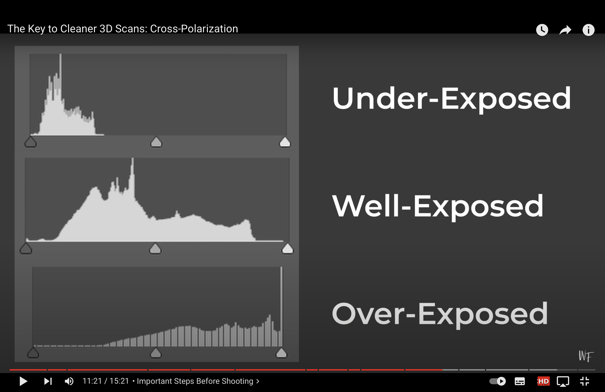
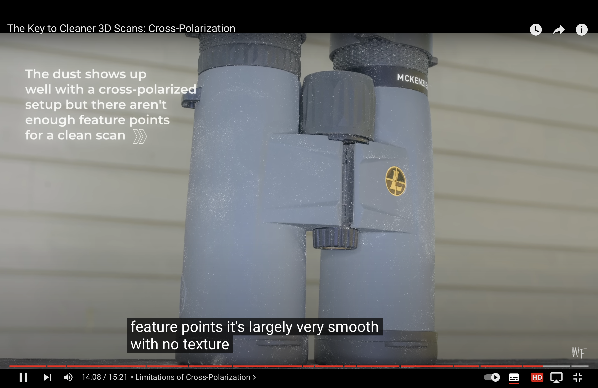
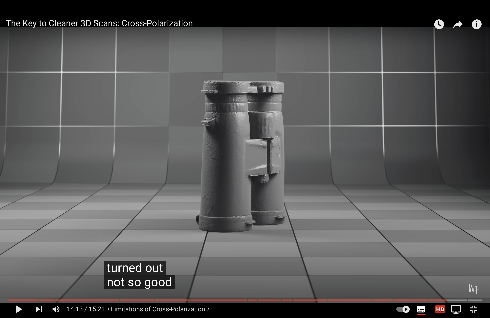

# This is for mounting and using polarized camera
1. 把相机装到光源设备上
2. 在相机镜头前加偏振片
3. 在安装的光源前加偏振片
4. 将发射/接收器装到相机顶部，并打开发射器开关，它的作用是在相机拍摄的同时触发光源发光进行拍摄，以消除阴影
5. 偏振片方向校准：在镜子前打开相机光源，旋转镜头前的偏振片，同时观察相机成像，当相机成像中光源的光最暗的时候就是最佳校准状态。因为镜子产生spectral反射光，我们的最佳校准位置就是要把镜面反射光全部过滤，即由光源产生的偏振光经过镜面反射的光全部被过滤，只留下这个偏振光经过漫反射后的光。
6. 在当前自然光条件下调整合适的相机曝光度和光源亮度（调整光源亮度是为了使光源照亮阴影部分的效果与自然光照亮其他部分的效果一样；调整相机曝光度是为了获得既不暗也不亮的合适图像亮度），使得图像的直方图均衡。（图像的灰度直方图均衡说明图像细节丰富，质量更高，不会整体过亮(over exposing)也不会整体过暗(under exposing)）
<vs>
合适的直方图

## notes
1. 拍摄的时候不要拍的过于快和连续，防止光源过热，这会引发过热保护。（亮度越亮，发热越厉害）
2. cross-polarization适用于表面细节丰富、特征点多的物体，这样扫描出来的物体重建效果好；若表面细节不丰富、特征点很少（光滑的物体）的物体被用于cross-polarization，则效果会不好。皮鞋效果好的原因是其表面有划痕、灰尘、磨损等，细节丰富，特征点多。
<vs>

