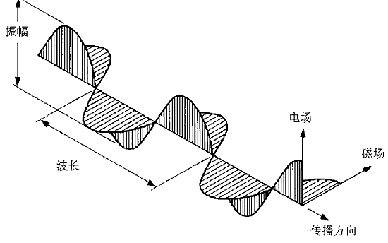
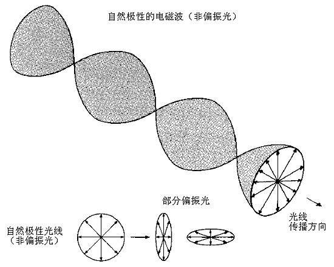
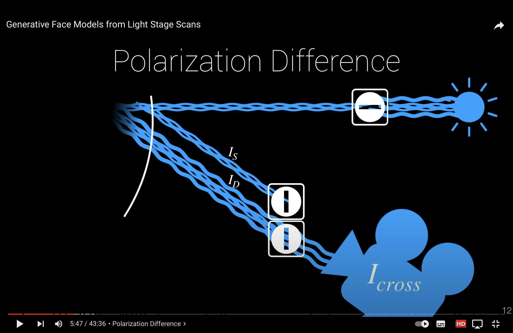
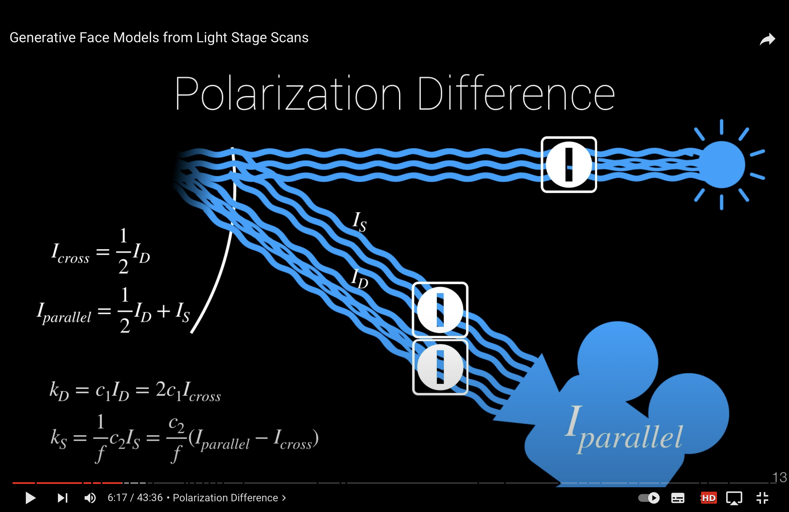

[toc]
# Daily summary
## 2022.8.24
### finished 
1. learning github

### assigned
1. lecture
   Games101: chapter 8 & 9
2. three videos and one paper
   1. [3d vision base](https://www.youtube.com/watch?v=CtyhRGq74js)
   2. [device principle](https://www.youtube.com/watch?v=GJ2gtQ0WxTU)
   3. [IRON](https://kai-46.github.io/IRON-website/): about relighting
3. ppt 
   [Differentiable Inverse Rendering](./files/Differentiable%20Inverse%20Rendering.pdf)

### notes

1. 原理
   1. 偏振的原理：
        &emsp;&emsp;许多偏振光在摄影中是有害的，如果用偏光镜消除了这些偏振光，许多照片会显得颜色更加饱和，画面更加清晰......
         
        &emsp;&emsp;我们知道，光是一种电磁波，是由与传播方向垂直的电场和磁场交替转换的振动形成的。它与无线电波没有本质的区别，仅波长更短一些而已。这种振动方向与传播方向垂直的波我们称之为横波。声波是靠空气或别的媒质前后压缩振动传播的，它的振动方向与传播相同，这类波我们称之为纵波。
          
        
          
         &emsp;&emsp;横波有一个特性，就是它的振动是有极性的。在与传播方向垂直的平面上，它可以向任一方向振动。我们一般把光波电场振动方向作为光波振动方向。如果一束光线都在同一方向上振动，我们就称它们是偏振光，或严格一点，称为完全偏振光。一般的自然光在各个方向振动是均匀分布的，是非偏振光。但是，光滑的非金属表面在一定角度下（称为布儒斯特角，与物质的折射率有关）反射形成的眩光是偏振光。偏离了这个角度，就会有部分非偏振光混杂在偏振光里。我们称这种光线为部分偏振光。部分偏振光是有程度的。偏离的角度越大，偏振光的成分越少，最终成为非偏振光。在以下的原理性讨论中，我们将不严格区分偏振光和部分偏振光。

         

         &emsp;&emsp;能够滤除偏振光的滤镜叫做偏振镜。普通的偏振镜叫做线偏振镜（PL镜）。把偏振镜装到镜头的前端，仔细旋转偏振镜，使得有害眩光减至最小甚至消失，这样就能拍摄出没有眩光的照片了。如果拍摄蓝天，天会显得更蓝、更暗。
   2. 自然光拍摄的图片，既有阴影，又有反光，影响了物体本身的颜色。 
   3. 可能会产生阴影的部分采用其他光源照射即可消除
   4. 不同颜色的光照到物体表面会产生不同的颜色和效果，实际采集照片时可以利用设备控制环境光照恒定
   5. 自然光都是原偏光照，只有某一偏振方向的光为线偏光照
   6. 自然光以布鲁斯特角发生反射后会变成线偏光。因此当自然光照射到物体表面时，表面的每一块microfacet都能反射回来一些线偏光（反射回来的大部分是原偏光），这部分线偏光可以进入特定的偏振片。
   7. 物体表面会发生镜面反射和漫反射。当入射光为线偏光时：镜面的反射光与入射光偏振方向一致，只是传播方向发生改变；而漫反射会产生原偏光。
   8. 当光照射到物体表面时，发生了镜面反射和漫反射。
        
      在所有microfacet中，每个镜面材质（specular）的microfacet反射的光中满足布鲁斯特角的光会发生极化变成偏振光，离布鲁斯特角越近的角度极化程度越高，越远极化程度越低，但他们都是部分极化光（partially-polarized light）。反射的线偏光会产生比较明显的反光视觉效果，我们的目的是消除反光，获得物体表面的纹理，以获得更为准确的重建结果。
       
      在所有microfacet中，每个漫反射材质（diffuse）的microfacet反射的光都还是原偏光。
   9.  进入镜片的光=漫反射分量+反射分量
2. 设备原理
   
   
   1. 在光源前面放置x方向的偏振片，使射出的只有x方向偏振的光，照射到物体表面产生反射光和漫反射光，在相机镜片处也放置x方向偏振的光；在光源前面放置y方向的偏振光可以得到
   2. 设备上的光源可以设置偏振，镜头也可以设置偏振。光源用来照射阴影部分消除阴影。
3. 目的
   1. 使用设备获得漫反射颜色对应的图像
   2. 用现有模型建立基于这些图像的模型，观察是否符合物体原色（无阴影和反光），符合原色说明得到的漫反射分量是正确的，只有其正确才能去解耦出正确的反射分量
   3. 利用手机拍摄的图像（漫反射分量+反射分量）通过nerf重建颜色，并利用这个颜色和得到的真实漫反射颜色解耦出（利用物理光照模型）漫反射分量和反射分量，目的即是获得最终的反射分量。

## 2022.8.26
### assigned
### finished
