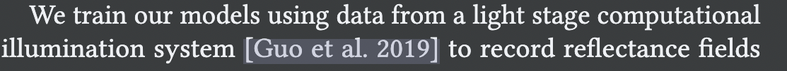
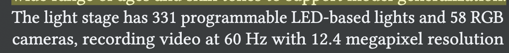

# 生成relighting dataset方法调研

## light stage image capture
1. 70个人，每个人9种表情，并且穿着不同材质的衣服、有不同的配件等。年龄、皮肤跨度尽量大。
2. 采集设备有331个可编程的LED灯和58个相机（每秒60 frame，resolution 12.4M）。
3. 打算发
4. 利用www.HDRIHaven.com上的200个HDR panoramic lighting environments进行random rotations，最终生成8M training examples。

## Matting and Foreground Acquisition
1. 某些viewpoints含有具体的background，可以在这些viewpoints下拍摄含有subject的image和没有subject只有bg的image，利用这对pair image去计算gt matting。
2. 有很多viewpoints是不含background的，对这些view没办法利用上述办法，因此需要利用上述方法形成的gt matting去train一个网络。然后利用这个网络（输入为bg image、off-the-shelf segmenter的segmenter结果和含subject image）估计这些viewpoints的matting，再利用这个matting和一些纯bg image（没有subject）去生成具有bg的image，将这个生成的image作为最终用于train的image，然后将这个matting用作gt。

## Albedo and Geometry Acquisition
1. Albedo通过对subject打一个均匀的全局光照获得（在均匀光照条件下，拍到的image与albedo只差一个真实尺度）。
2. Geomerty通过photometric stereo equation获得。

## hardware
1. 两次引用这篇文章

The Relightables: Volumetric Performance Capture of Humans with
Realistic Relighting

### 具体
1. 331 programmable lights和16 IR structured light projectors和90个high-resolution 12.4M camera（32 IR，58 RGB），capturing images with 60Hz。
2. 相机参数：Both our RGB and IR cameras are Ximea scientific cameras (Ximea MX124) that use the Sony® IMX253 sensor, which is a CMOS, globalshutter, 4112 × 3008 resolution chip with good quantum efficiency. （C-mount camera lens (Kowa LM16HC) with FOV of about 48° along the long-axis）；
   The IR cameras are built using monochrome versions of the Ximea MX124 cameras and an IR bandpass filter, centered at 860nm.（因此红外光的波长也在860nm，使得IR cameras tightly tuned to see only 860nm light）.

   红外光装置setting已知

   RGB LED灯的配置已知

3. 相机位置：Six cameras are located near the top of the Light Stage, and the remaining cameras are split into three levels: torso and head, mid-section, and legs and feet
4. 相机calibration有方法指定