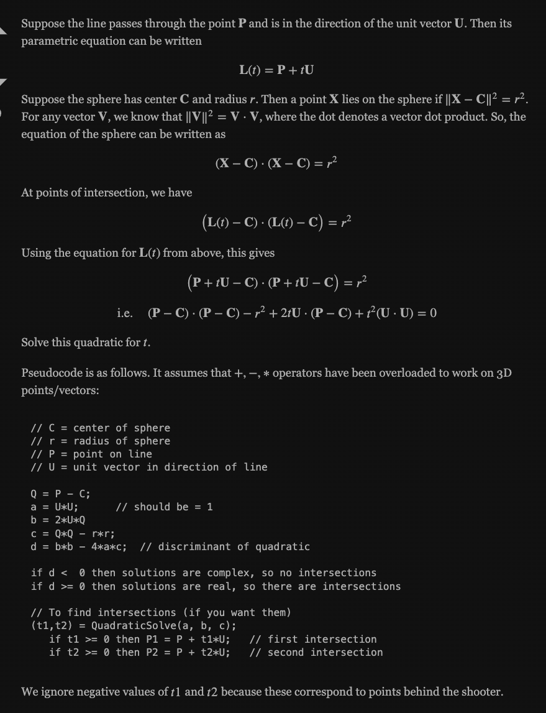
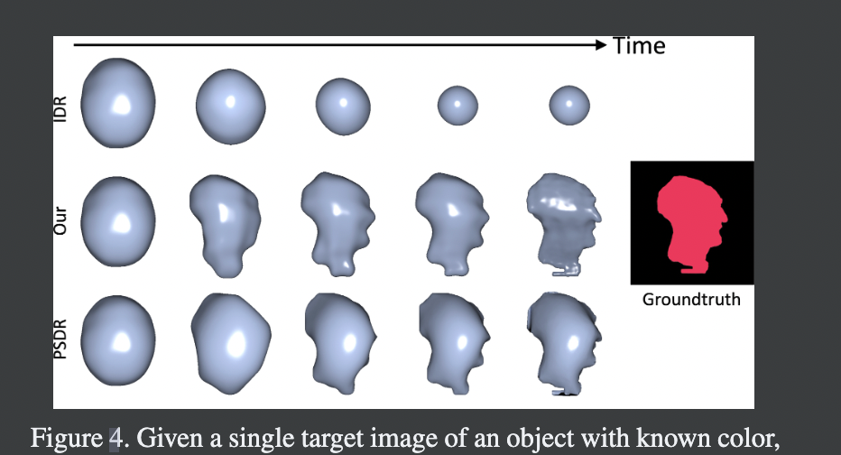
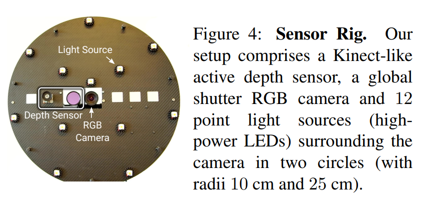
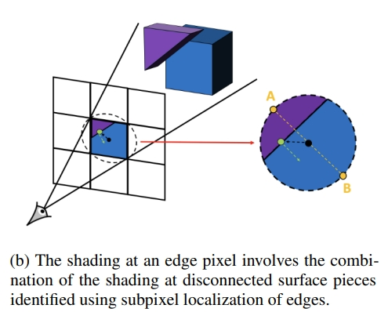
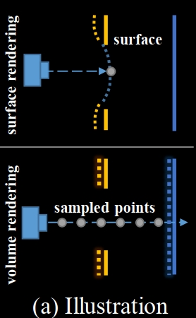
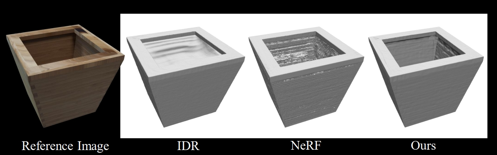
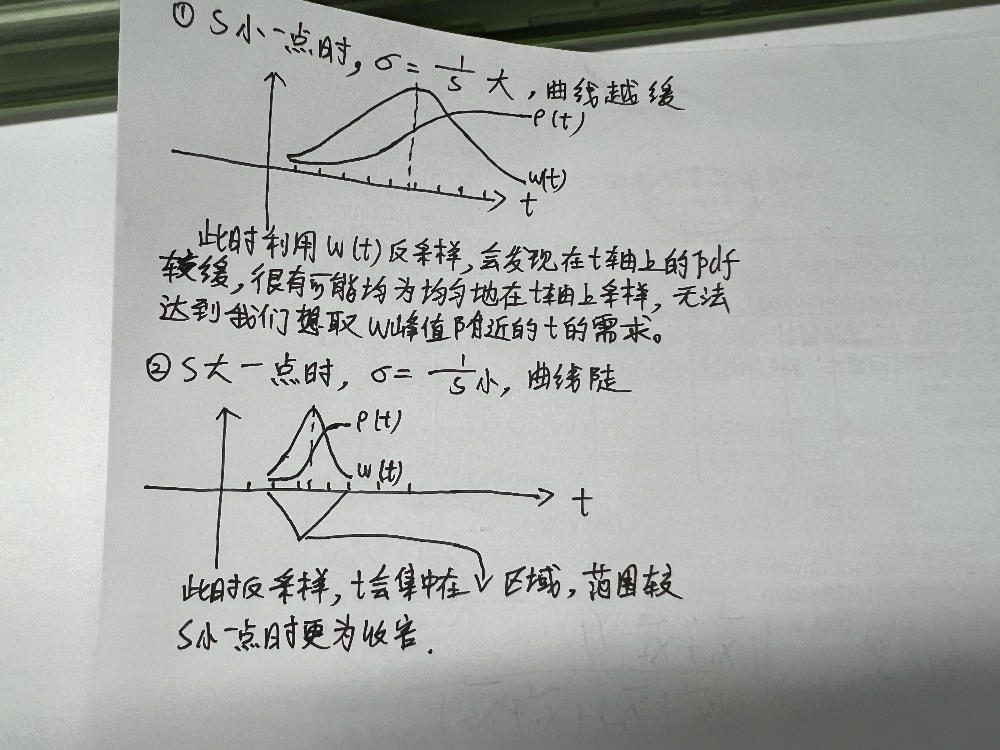
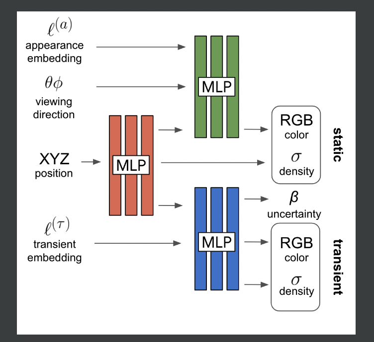
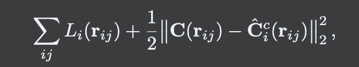
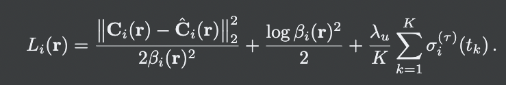

[toc]
# Notes for papers

## IDR：Multiview Neural Surface Reconstruction with Implicit Lighting and Material

### innovation
1. 之前的工作没考虑光照和surface material对appearance的影响，也没有考虑优化camera locations和orientations。此工作可以同时进行。
2. 以一个continuous implicit neural network来建模BRDF、lighting、geometry（造成shadow-secondary lighting）综合作用下产生的surface appearance，即rgb。

### methodology
1. ray-tracing到surface point的depth。
2. 对surface point进行reparameterization。
3. 计算rgb

### details
1. IGR（Implicit Geometry Regularization），即eikon loss，能够使得surface更加smooth和realistic。
2. 这里将某个camera location c、camera view direction v下通过sdf $S_{\Theta}$看到的surface point的depth t，作为上面这三个参数的函数，即$t(c,v,\Theta)$。而c、v、$\Theta$都是continuous的，因此t在整个定义域上是continuous且differentiable的。因此对point x（$x=c+tv$）算它们三个的梯度时，能传到$\Theta$的梯度只能经由t传到。
3. 对c、v、$\Theta$的优化可以这样来理解：随着优化进行，当前pixel产生的ray的出发点（camera center）和方向都会逼近真实的camera pose，在不断的优化下，camera pose逐渐接近真实或者说可以认为已经优化完成，此时需要更注意sdf的优化，通过对x（或者说t）在当前view direction方向上进行移动，可以讲surface point在view上进行移动，以让其更接近真实的shape。
4. 对x进行reparameterization后，我们可以发现对某个固定的c和v（即假设不优化c和v，或c和v的优化已经收敛时），在固定的c和v上的更新后的x的下个参数，只会在view direction上变动。

---

## Physg: Inverse Rendering with Spherical Gaussians for Physics-based Material Editing and Relighting

### problems in previous works 
1. Neural rendering methods work well for the task of interpolating novel views, but do not factorize appearance into lighting and materials, precluding physically-based appearance manipulation like material editing or relighting.
2. 

### innovation


### limitation
1. Don't model self-occlusion or indirect illumination.
2. 

### overview
1. MLP for SDF function.
2. SGs for environment map which represents the environment light.
3. BRDF consists of spatially varying diffuse albedo and a shared monochrome isotropic specular component. The diffuse albedo $a$ is calculated by a MLP $\Phi$.
   That is:
   $$
   f_r(\omega_o, \omega_i;x) = \frac{a}{\pi} + f_s(\omega_o, \omega_i;x)
   $$
   where:
   $$
   f_s(\omega_o, \omega_i;x) = M(\omega_o, \omega_i)D(h)
   $$
   In the BRDF euqtion, $f_s$ is represented by SGs. Besides, $\omega_i\cdot n$ is represented by a SG.
4. 


## Modeling Indirect Illumination for Inverse Rendering


### some conceptions
1. ray-sphere intersection
   
   Here, the center of the sphere is at the origin of world coordinate. So, $Q=P$.
   ``` python
    cam_loc = cam_loc.unsqueeze(-1)
    # directions are world coordinates
    ray_cam_dot = torch.bmm(ray_directions, cam_loc).squeeze()
    under_sqrt = ray_cam_dot ** 2 - (cam_loc.norm(2,1) ** 2 - r ** 2)

    # Here the center of the sphere is the origin of the world coordinate
    under_sqrt = under_sqrt.reshape(-1)
    mask_intersect = under_sqrt > 0  # These ones greater than 0 can intersect sphere.

    sphere_intersections = torch.zeros(n_imgs * n_pix, 2).cuda().float()
    sphere_intersections[mask_intersect] = \
        torch.sqrt(under_sqrt[mask_intersect]).unsqueeze(-1) * torch.Tensor([-1, 1]).cuda().float()
    sphere_intersections[mask_intersect] -= ray_cam_dot.reshape(-1)[mask_intersect].unsqueeze(-1)
   ```
   In the code, *under_sqrt* is $\frac{b^2}{4} - ac$. To calculate for t, we have
   $$
   t = \frac{-b\pm \sqrt \Delta}{2a}
   $$
   We can know from the code that ```torch.sqrt(under_sqrt[mask_intersect]) * torch.Tensor([-1, 1])``` gets $\pm \Delta$. So by addition, we get the two ts.
2. 

### problems in previous work
1. Previous capture systems, such as light-stages with controlled light directions and cameras [8, 11, 31], using a colocated flashlight and camera in a dark room [2, 3], and rotating objects with a turntable [7, 26], **show limitations in user-friendliness**.
2. Methods capturing objects under natural illumination often show complex effects such as soft shadows and interreflections. Prior methods usually ignore both selfocclusion and interreflection [29] in order to reduce computation, or only model visibility [32] or limit the indirect lighting to a single bounce with known light sources. As a result, the effect of indirect illumination in the captured images is prone to being baked into the estimated diffuse albedo to compensate for this gap.
3. Single-image inverse rendering methods rely heavily on the strong prior of the planar geometry. They can effectively infer plausible materials and normal maps from a single image but usually cannot recover **spatially-varying 3D representations** of these factors.

### limitations
1. Strongly relies on fine geometry as an input. We cannot deal with the case where the geometry fails to be reconstructed.
2. We parameterize BRDF with fixed F0 = 0.02 in the Fresnel term. In other words, we assume that the recovered materials are dielectric.


## IRON: Inverse Rendering by Optimizing Neural SDFs and Materials from Photometric Images

### innovation
1. Compared to IDR、Nerf、Neus etc. that entangle lighting and meterial, this work can disentangle them.
2. Previous works don't consider the derivative of edge points, leading to inability to deform shape along the edge normals.
   


In this figure, under the single viewpoint condition, algorithms without computing edge derivative along normal directions are not able to defrom the shape along normal directions.（也就是在初始化的sdf下，没办法把shape往normal的方向拉，因为reparamterization时只考虑沿着ray direction的方向去优化）
3. Be able to rendering sub-pixels.

### methodology
1. 首先用IDR的方式训练一个sdf net和一个neural radiance field net。
2. 然后同时训练albedo（第一步的neural radiance field作为初始化）、roughness、specular、sdf、point light，并以GGX model进行rendering。

### details
1. 作者使用co-located camera和light（point light）拍摄，并在计算时将point light的位置近似和camera center相同，这样使得view direction和light direction相同（差个符号）。这种近似在object较远的时候误差会较小。

2. 作者使用一个点光源来近似light，并采用inverse-square fall-off对光源的强度进行建模。
3. 当view direction与surface normal垂直时，代表我们看到的是object的edge。
4. 比较重要的一个关于梯度计算的点：我们计算loss时本质上是要从loss back-propagate 到net weights的，但是在这里因为x的获得不是differential的，所以梯度没办法通过x back-propagate到network的weights中，因此需要reparameterize x。本质上来说要reparameter x，需要保证构造的equation在当前参数下的值($S_{\Theta}, n_0$)等于$x_0$，且当前参数下的梯度等于未构建实体equation而通过implicit function计算时的first-order梯度（因为算weight gradient时用的都是first-order），因此后续才有构造一个equation证明这两点的推导。
5. 只对edge-pixels进行walk process来找edge surface points，而找这种edge pixels，是通过ray-tracing得到每一个pixel的depth之后，给每个pixel附上这个depth值，然后算Sobel 梯度，梯度较大的pixel说明其与周围的pixel之间存在depth突变，则其为edge pixels。
6. Figure 2、4想要告诉我们的点时，在一个view point上进行训练时，IDR由于只计算演着view direction方向的t变化，导致shape只会在view direction方向被伸缩，而没办法往edge normal的方向伸缩，因此无法将一个初始化的sdf shape在edge normal方向慢慢通过优化拉伸变大。但事实上在multi-view训练时，由于每个viewpoint都几乎会被扫到，所以整个shape可以朝向各个方向被伸缩，最终达到准确的shape。


### limitation


### some conceptions
1. **edge pixel & interior pixel & subpixel**
   * **edge pixel**: where shading colors is a combination if colors at disconnected surface pieces.

    

   * **interior pixel**: pixels whose content comes from smooth and continuous surface

   * **subpixel**: a small area inside a pixel
2. photometric images: camera and light is co-located.
3. 可以讲3D normal投影到2D images形成2D normal map。


### tricks


### mathematical derivation
1. walk step

2. 

---

## NeuS: Learning Neural Implicit Surfaces by Volume Rendering for Multi-view Reconstruction

### advantages and limitations in previous works
* IDR:
  1. fail to reconstruct objects with complex structures that causes abrupt depth changes: The cause of this limitation is that the surface rendering method used in IDR only considers a single surface intersection point for each ray. Consequently, the gradient only exists at this single point, which is too local for effective back propagation and would get optimization stuck in a poor local minimum when there are abrupt changes of depth on images
  ---
  illustration of surface rendering and volume rendering:
  

  (with the radical depth change caused by the hole, the neural network would incorrectly predict the points near the front surface to be blue)

  ---
  examples of idr limitation near the edges with abrupt depth changes: 
  

  ---
  2. object masks are needed as supervision for converging to a valid surface

---

* traditional multi-view 3D reconstruction methods(surface and volumetric methods)
  1. surface methods(point-(sparse) and surface-based(dense) methods)
     * pipeline: sparse reconstruction -> dense reconstruction
     * limitations: heavily relies on the quality of correspondence matching. and the difficulties in
     matching correspondence for objects without rich textures often lead to severe artifacts and missing parts in the reconstruction results
  2. volumetric methods
     * pipeline: estimating occupancy and color in a voxel grid from multi-view images and evaluating the color consistency of each voxel

  limitations for traditional methods: Due to limited achievable voxel resolution, these methods cannot achieve high accuracy

---

* neural implicit representation
  * surface rendering-based methods
    * assume that the color of ray only relies on the color of an intersection of the ray with the scene geometry, which makes the gradient only backpropagated to a local region near the intersection
    * limitations: struggle with reconstructing complex objects with severe self-occlusions and sudden depth changes
  * volume rendering-based methods
    * render an image by α-compositing colors of the sampled points along each ray
    * advantages: can handle abrupt depth changes, because it considers multiple points along the ray and so all the sample points, either near the surface or on the far surface, produce gradient signals for back propagation.
    * limitations: since it is intended for novel view synthesis rather than surface reconstruction, NeRF only learns a volume density field, from which it is difficult to extract a high-quality surface

---
### innovation

---
### limitation

---
### some conceptions
* gradient$\nabla$
  * assuming $f(x,y,z)$ has a first-order continuous partial derivative in area $G$, for every $P_0(x_0,y_0,z_0)\in G$, there exist a vertor
  <br>
  $$
  f_x(x_0,y_0,z_0)\vec{i}+f_y(x_0,y_0,z_0)\vec{j}+f_z(x_0,y_0,z_0)\vec{k}
  $$
  which is the gradient of $f(x,y,z)$ at $P_0(x_0,y_0,z_0)$, it is denoted as **grad** $f(x_0,y_0,z_0)$ or $\nabla f(x_0,y_0,z_0)$
  <br>
  so
  **grad**$f(x_0,y_0,z_0)$ = $\nabla f(x_0,y_0,z_0)$
  &emsp;&emsp;&emsp;&emsp;&emsp;&emsp;&emsp;&emsp;&emsp;&emsp;=$f_x(x_0,y_0,z_0)\vec{i}+f_y(x_0,y_0,z_0)\vec{j}+f_z(x_0,y_0,z_0)\vec{k}$
  <br>
  therefore:
  $\nabla f$ is such a vector that its direction is the direction that f changes the fastest.
  <br>
  if we introduce a surface $f(x,y,z)=c$ as a level-set, we can know that direction of the gradient $\nabla f(x_0,y_0,z_0)$ at point $(x_0,y_0,z_0)$ of $f(x,y,z)$ is the direction of the normal of $f(x,y,z)=c$ at this point.

* the Eikonal term loss:
  When optimizing the loss using the loss functions, two questions emerge:
  1. Why the parameters$\theta$ of the MLP found by the optimization lead MLP to be a signed distance function. Usually, adding a quadratic penalty with a finite weight is not guaranteed to provide feasible critical solutions, i.e., solutions that satisfy the desired constraint itself.
  2. Even if the critical solution found is a signed distance function, why should it be a plausible one? There is an infinite number if signed distance functions vanishing on arbitrary discrete sets of points $\xi$ with arbitrary normal directions.

  It is proved that this loss function used in gradient descent is effective for getting a smooth and plausible one.

* Why perform upsamping using different s in the code?

* 

---
### tricks
1. cosine decay schedule--learning rate:
   * definination: 
      * *self.iter_step*: current step
      * *self.warm_up_end*: warmming-up iter
      * *self.end_iter*: the endding iter
      * *alpha*: the final lr
   * usage
      * for **$iter < warm\_up\_end$**, lr increases linearly from 0 to *self.learning_rate*
      * for **$warm\_up\_end < iter < end\_iter $**, lr decreases from *self.learning_rate* to *alpha* following the cosine decay schedule

   ``` python
   if self.iter_step < self.warm_up_end:
            learning_factor = self.iter_step / self.warm_up_end
        else:
            alpha = self.learning_rate_alpha
            progress = (self.iter_step - self.warm_up_end) / (self.end_iter - self.warm_up_end)
            learning_factor = (np.cos(np.pi * progress) + 1.0) * 0.5 * (1 - alpha) + alpha

        for g in self.optimizer.param_groups:
            g['lr'] = self.learning_rate * learning_factor
   ```
2. about number processing
   * number should deviate from its theoretical one:
      ``` python
      z_vals_outside = torch.linspace(1e-3, 1.0 - 1.0 / (self.n_outside + 1.0), self.n_outside)
      ```
      which takes numbers between 1e-3 and 1.0-... rather than 0 and 1
   ---
   * when a number serves as a denominator, it should add a small number(usually **1e-5**) to avoid cases like divided by 0 or numbers almost approximates 0.

---
### problems
1. Note that the standard deviation of $\phi_s(x)$ is given by $\frac{1}{s}$, which is also a trainable parameter, that is, $\frac{1}{s}$ approaches to zero as the network training converges.
   solution: As the training goes, the ideal situation is that the weight function is very steek which means the standard deviation is very small.
2. figure 3: visible and invisible surface
3. why this way can solve the problems caused by abrupt depth change and occlusion and why nerf can handle abrupt depth problems
4. why $\alpha$ takes the *max* operation? According to the feature of $\rho(t)$, $\alpha$ naturally obeys this rule.
5. mask loss
6. renderer.py line 230: dirs are unit vectors, but gradients may be not though the gradient loss forces them to be like unit vectores
7. cos anneal ratio at renderer.py line 230

---

### mathematical derivation
* $$
  \begin{aligned}
  \omega(t) &= \displaystyle\frac{\phi_s(f(p(t)))}{\int_{-\infty}^{+\infty}\phi_s(f(p(u))){\rm d}u}\\
  &= \displaystyle\frac{\phi_s(f(p(t)))}{\int_{-\infty}^{+\infty}\phi_s(-|{\rm cos}\theta|\cdot(u-t^*)){\rm d}u}\\
  &= \displaystyle\frac{\phi_s(f(p(t)))}{-|{\rm cos}\theta|^{-1}\int_{-\infty}^{+\infty}\phi_s(-|{\rm cos}\theta|\cdot(u-t^*)){\rm d}(-|{\rm cos}\theta|\cdot(u-t^*))}\\
  &= \displaystyle\frac{\phi_s(f(p(t)))}{-|{\rm cos}\theta|\cdot\int_{-\infty}^{+\infty}{\rm d}\Phi(-|{\rm cos}\theta|\cdot(u-t^*))}\\
  &= \displaystyle\frac{\phi_s(f(p(t)))}{-|{\rm cos}\theta|\cdot\int_{+\infty}^{-\infty}{\rm d}\Phi(v)}\\
  &= \displaystyle\frac{\phi_s(f(p(t)))}{-|{\rm cos}\theta|\cdot(-1)\cdot1}\\
  &= |{\rm cos}\theta|\phi_s(f(p(t)))
  \end{aligned}
  $$

* consider this naive solution
  $$
  \omega(t) = \displaystyle\frac{\phi_s(f(p(t)))}{\int_{-\infty}^{+\infty}\phi_s(f(p(u))){\rm d}u}
  $$
  the reason why this $\omega (t)$ is not occusion-aware is that when this one is disentangled with $T(t)$ and $\rho (t)$, $\rho (t)$ may be negtive in certain segment of the ray, thus the $T(t) = e^{-\int_0^{t}\rho(u){\rm d}u}$ will increase and at the second surface intersection, $T(t)$ becomes equal to the first intersection. And the $\rho(t)$s at these two intersections are equal, thus the two $\omega(t)$s equal. After constrain the $\rho(t)$ as ${\rm max}(\cdots, 0)$, $T(t)$ won't increase anymore but keep decreasing, so although $\rho(t)$s at these two intersections are equal, their $\omega(t)$s don't equal anymore.


## NeRV: Neural Reflectance and Visibility Fields for Relighting and View Synthesis

### innovation
1. 相对于NeRF，解决了NeRF不能恢复material和进行relighting的缺点。
2. 相对于一些传统方法，又可以利用NeRF重建3D model。
3. 虽然NeRF in the wild采用appearance code来表示每一张image的lighting可以进行某种程度上的relighting，但是它不能利用一些新的lighting而只能用学到的lighting。

### Methodology
前提：global illumination中，只衡量一次弹射。
定义：三个MLP
   1. 一个MLP输出每个point x的volume density $\sigma$，输入为x的坐标。（这里将volume density作为shape的表示，其实也可以理解，因为density越大的地方代表着有物体，空气的density小）
   2. 一个MLP输出每个point x的diffuse albedo（这里默认每个point没有specular分量来简化）和roughness。（遵循microfacet模型），输入为x的坐标。
   3. 一个MLP输出在某个点沿着某个方向的visibility（衡量能不能看到light source，看得到light source时可利用这个MLP输出的visibility来计算radiance，看不到时认为是打到了物体上，被物体遮挡，此时可使用这个MLP的termination depth）和termination depth（从这个点到termination的距离）。这里的visibility其实就是NeRF中的transmittance（即volume density的积分），在NeRF中认为某个点的transmittance越低，其radiance（rgb）传输到camera的比例越少。
方法：
   1. 传到某一个camera pixel的radiance（rgb）由两部分组成，一个是direct illumination，一个是indirect illumination。
   2. 对某个pixel的渲染还是采用NeRF在ray上sample点的方式。不同的是，在NeRF中通过MLP获得每个点的rgb值，即认为每个点自己含有能量，能够emit radiance；但是在NeRV中，认为每个点本身不含能量，它们的能量来源于别的光线，即每个点朝向pixel发射的radiance来源于反射（遵循PBR）。
   3. 对于direct分量来说：先算出ray上每个sample的点的reflectance作为NeRF中的rgb值，然后根据MLP得出每个点的volume density，然后根据NeRF中的方式获得ray的rgb值。每个点的reflectance通过PBR获得，incident light由light source直接产生（在sample点的hemisphere上采样入射光方向），然后将这个incident radiance与visibility（MLP获得）相乘作为最终到达sample点的radiance；diffuse albedo和roughness由MLP获得，然后根据microfacet模型产生BRDF；点的normal通过对density的MLP进行求导获得（方式与SDF net一样。可以这么理解这个normal的计算，在sdf中sdf=0代表着某个surface，而对ƒ求导代表着surface的normal；在这里density=m代表着某个surface，故用其对coordinate求导也代表着normal）；最终对采样的入射光方向积分获得最终的朝向pixel的reflectance。
   4. 对于每个indirect分量来说：不再对ray上的每个sample点计算refletance，然后根据volume rendering获得rgb值。而是认为每条光线最终会打到一个hard surface上产生一个intersection（它有一个depth），然后对这个intersection进行PBR产生一个reflectance（incident light不来源于light source而是来源于被light source照射到的点，因此light到intersection时已经是第二次反射，这才成为indirect），这个reflectance就类似于surface rendering的rgb值。在这里，这个depth遵循NeRF中计算depth的方式（仅将volume rendering中的rgb值换成每个sample点的depth值，rgb权重大的点，其depth的权重也大）。而有了depth后，就可以计算这个intersection的坐标。得到坐标后，在这个intersection的hemisphere上采样m条光线，将intersection坐标和m条光线的方向输入visibility MLP来计算每条光线的termination depth $t''$，根据这个$t''$和m条光线方向可以计算出m个termination的坐标。这m个termination都可能获得light source的radiance（由MLP产生的visibility来衡量是否能接收到light source的radiance），然后再根据PBR产生m个reflectance作为intersection的入射光线，然后在intersection处做PBR，输出的reflectance作为pixel的indirect分量。


## NeRF in the Wild: Neural Radiance Fields for Unconstrained Photo Collections

### innovation
 NeRF短板：NeRF认为不同的image中，从同一个方向观察同一个点会得到相同的rgb值(因为NeRF适用的场景都在一些室内的短时间场景，其间光照条件什么的比较恒定)。但是这不符合outdoor photography呈现出来的效果（1、室外的环境时刻在变，即光照、空气等时刻在变，这会导致射入camera的radiance时刻在变。且由于radiance在变，相机内部也会动态调整exposure、white balance、tone-mapping等，这使得该效应被加剧。 2、现有的一些数据集都是在无人的地方拍摄的，镜头中几乎不会有正在动的object（如transient occluders），但是室外环境中拍摄的image可能包括行人，他们的出现会改变拍摄的一组图像中不同图像对同一方向同一个点的观察）。因此当NeRF用于移动的物体或多样的光照时，其效果大打折扣。这使得NeRF无法用于大规模的野外照片集（光照不同：照片之间的跨度往往以小时甚至年来算；包含行人或车子）。

 改进：
 1. 利用apperance code来建模不同的光照环境，以解决NeRF需要恒定光照的限制。
 2. 利用transient head和uncertainty来建模transient occluders，建模后可以直接移除transient分量以获得static分量。

### methodology


1. 最终输出的rgb分为两个分量：static head、transient head。
2. static：在NeRF输出$/sigma$和$z(t)$（feature vector）后，加入一个latent apperance code来建模每张图片单独的光照条件（每张照片都有一个appearance code，trainable，意味着只有训练数据才会有code。在test时，可对不同的code进行插值来获得新的code，或者直接随机一个code，实验证明这只会改变光照条件，不会改变geometry）。
3. transient：如上图一样在每个sample点处再生成一个transient的量，其volume rendering同static分量相同。最终的rgb值由static分量和transient分量线性叠加。
4. uncertainty：$\beta$是由MLP产生的。本方法对uncertainty的建模认为，每个pixel的颜色值遵循正态分布，每个pixel在当前训练阶段预测的颜色值是正态分布的均值，然后这个pixel的variance值就是$\beta^2$。variance值越大代表当前pixel的值不太稳定，其是不可靠的pixel，在计算loss时应该被排除在外。一条ray上的每个sample点都有一个$\beta_i(t)$，然后对一条ray进行alpha compositing才能获得这条ray的variance $\beta_i$。
5. loss


   1. 本文采用NeRF的coarse-to-fine策略，total loss一共有两部分loss，一个是coarse，一个是fine。
   2. coarse部分只采用appearance code（static和transient都有），没采用uncertainty。
   3. fine部分的loss中，第一项代表着variance$\beta$越大，这个pixel越不可靠，因此其权重应该越小，对loss的影响越小；第二项是对第一项的惩罚loss，用于减小$\beta$值，防止所有pixel的$\beta$值都很大，使网络认为所有pixel都不可靠而学不到东西。第三项是对transient density的惩罚，防止transient density过大，抹杀了static density的作用（算法本身想获得static scene）。

## HDR-Plenoxels: Self-Calibrating High Dynamic Range Radiance Fields

### innovation
1. 前人的方法都是通过固定相机并调整曝光度以获得multi-exposure images，然后根据这些multi-exposure LDR images去合成HDR images。这种方法局限于view point，不能改变相机位置。本文提出对HDR radiance进行重建，可以在任何视点获得LDR images。
2. 本文可以通过控制white balance、exposure来获得不同效果的image。


### methodology
前提：不用mlp；不用successive的空间表达，而是用voxel。
方法：
1. 整个bounded space在训练初始阶段被划分成均匀的voxels。每个voxel的八个顶点分别存有28维的参数，其中1维代表顶点的volume density值，27维中的3个9维参数分别对应rgb中每个通道的SH coefficients。在voxel中的任一点的上述28维参数，可以通过对8个顶点的值进行trilinear插值获得。插值完后可以得到该点的28维参数。然后可以根据SH basis function，把27维参数输入其中得到rgb值（SH basis function中，可以输入相机中心到该点的方向即view direction来获得该点不同方向的颜色）。
2. 建HDR radiance时同nerf一样，从每个pixel发出一条光线，在光线上sample点，然后根据每个点所处的voxel进行插值（bounded space被voxel划分，同时也可以有连续的3d坐标，它们只是尺度不同，判断point位于哪个voxel是通过，将3d坐标（例如坐标位于0-1）值scale到voxel的坐标值来判断位于哪个voxel。例如voxel的shape为[256,256,256]，坐标值为(0.1, 0.2, 0.3)，那么将坐标值乘上256即可获得其位于哪一个voxel里），获得每个点的rgb值和density值，然后根据nerf的volume rendering来获得该ray（pixel）的$I_H$值。随着训练的进行，不含内容的voxel（所有顶点的28维参数均为0，且该voxel周围的所有voxel也满足参数都为0）会被删除，含内容的voxel会被进一步划分成更小的voxel来提高精度。实际的数据结构通过存储含有内容的voxel的indices来query voxel。
3. 得到$I_H$后，其会进入某个pose的相机，然后相机进行一系列加工将其转换为$I_L$。首先对rgb值进行白平衡，其次将白平衡后的rgb值去query CRF获得最终的LDR rgb值。

策略：
1. 因为white balance和exposure都是直接manipulate pixel intensity，所以在这里会有歧义，增大曝光时间和改变白平衡系数可能对pixel intensity的改变是一样的。，因此将它们的效果都归到white balance的3-channel系数中。作者发现在这样的策略下，white balance系数可能会被训练得非常大或者非常小。这一块的笔记做在了文中。
2. 除了exposure和white balance之间有歧义，white balance和SH coefficients之间也会有歧义。这一块内容笔记也做在paper中。
3. 在输入数据极其不稳定的情况下，在上述两种策略的加持下，训练的前期可能还是稳定的，但是后期当白平衡系数更新的速度与SH coefficients更新的速度不一致时，可能又会发生上述问题。解决方法的笔记在文中。
4. 过饱和区域、欠饱和区域的pixels的loss权重应该尽可能小，避免网络学习过饱和、欠饱和的模式。文中认为0.15-0.9的dynamic range不属于过饱和、欠饱和。

loss：
1. reconstruction loss中的saturation mask就是控制过饱和、欠饱和区域的loss权重。
2. CRF的smooth loss其实就是对256个控制点中的每个点算二阶离散导数($f(x+1)+f(x-1)-2f(x)$即为x点的二阶导数)，求其MSE并最小化。这使得CRF更加平滑，插值出来的最后的rgb值也会更加平滑（实际上位于两个控制点中间的部分都是连续的，因为是线性函数插值获得的。求二阶导数使其趋向于0使得分段函数的分段点更加平滑，即分段点两侧单侧一阶导数趋向相等，可导->连续）。
3. TV loss也是一种全局平滑，这使得相邻的density和SH coefficients更加连续，以保证空间geometry和颜色的一致性。

---

## NERF++: ANALYZING AND IMPROVINGNEURAL RADIANCE FIELDS

### innovation
1. NeRF在训练时，对synthetic dataset界定bounding depth以在这个depth range中取t值，对real dataset使用NDC将0->无穷的depth变换到0-1来sample当成0-无穷。这样的sample方式可能会不够精确，实际的foregroud内容可能只占了depth range的一小部分。本方法利用一个bounding sphere将foregroud和backgroud分开。分别采用不同的坐标来表示内外sample点的坐标，分别对内外sample点用2个MLP来获取rgb值和density值，进行volume rendering。

### methodology
精华部分都在paper section 4，笔记都做在paper中。

---

## Nerfies: Deformable Neural Radiance Fields

### innovation
1. Free capture system(hand-held monocular cameras: 1. Solve the problem of nonrigidity, i.e., cannot keep still. 2. Solve the problem of priors for previous work, here there is no priors, just regularization)
   1. Use elastic regularization to keep rigidity and allow existing nonrigidity like face.
   2. Use background regulatization to align object location.
2. 

### methodology
1. 利用canonical coordinate去建模一个template volume，其中包含static scene。
2. 然后为每一帧建一个observation coordinate和一个trainable deformation code，渲染方式与Nerf相同，唯一的区别就是sample的点需要同deformation code一起query deformation MLP来获得其在template volume中的坐标（即其相对于起初的static scene有了哪些变化）。利用mapping后的point去query Nerf MLP（含appearance code）获得rgb and density。

### detail
1. 通过hand-held的方式采集数据，但是因为人是动的，所以无法用colmap对人上的feature进行reconstruction。这里采用foreground mask，截掉foreground部分，仅利用background（static）部分的feature进行colmap reconstruction。
2. Elastic部分：
   1. deformation mlp将observation frame下的一个point X mapping到canonical frame下的一个point Y，这种映射由mlp隐式实现，我们无从得知具体的transformation matrix，但是可以利用Jacobian来近似得到这个transformation（Jacobian可以获得这个映射的最精确的first-order approximation）。由于一个n*n的matrix J代表着一个transformation，而这个transformation由scale和rotation组成，且这个J可以svd分解为$J=U\sum_{}V^T$，因为U和V都是orthogonal matrix，因此它们都是旋转矩阵，而$\sum_{}$是一个diagonal matrix代表着scale，因此svd就可以把这两种transformation decompose。由于我们在transformation中不想要scale，而只想要rigid transformation（rotation and translation），所以要把scale尽量变为1.
   2. 将scale变为1有多种方式。以前的paper是通过算J和$UV^T$的loss来达到目的，因为当它们俩严格相等时，也就是意味着$\sum_{}$为identity matrix。而本文直接通过singular value来优化。
   3. 在优化singular value时，取log的作用：当你考虑一个值为0.1和值为1.9的singular value的时候，不用log算出来的loss是一样大的，但这显然不合理，因为0.1意味着缩小的倍数是10倍左右，1.9意味着放大的倍数是2倍左右，在这样的情况下，缩小0.1倍这个样本应该有更大的梯度去优化网络，但是loss相同时网络并不能捕捉到这一点，我们需要让网络知道这一点。结果就是在这种不平衡的loss下，网络在训练多个样本之后，倾向于将，这样就会导致elastic loss更偏向于缩小。因此nerfies提出用log，这样0.1的loss和10的loss是一样的（正负号相反，但因为取abs，所以一样），就能控制网络不会偏向于放大或者缩小。
   4. 文章又同时考虑到，人脸等区域确实有nonrigidity部分，因此并不把这种transformation完全限制为rigid。于是作者加了一个robust loss，利用这个了loss对singular value求导后可以发现，对于那些value比较大的情况，loss只传很小的梯度去使得mlp 做rigid transformation，意思就是value比较大的情况就是代表着类似人脸变动这样的nonrigidity，我们不应该去强制限制其为rigid，所以对这样的样本不传递或几乎不传递gradient。而value比较小的情况，可能就确实是rigid部分，只不过离rigid有一些bias，因此我们对其施加regularization。
   5. 对rigid transformation的整体理解：通常我们说transformation都是一个matrix，但是因为这里用mlp implicitly encode the mapping，因此我们无法获得具体的transformation matrix，对于这个scene来说，可能对不同区域存在多个transformation matrix，但是因为我们是implicity mapping，我们可以整体理解为mlp是对整个scene的一个transformation，为了让这个transformation 是rigid的，我们就需要让sample到的点都满足scale的约束。由于mlp是连续的，因此对sample的点进行约束后，整体的mlp上的每个点都会倾向于scale=1，这就实现了整体的transformation的rigidity。
3. Background regularization部分：
   1. 这里通过colmap重建出来的sparse points的coordinates来约束在canonical和observation frame中，bg部分的point的坐标不应该改变。
   2. 原因：我们可以intuitively认为bg部分不会改变位置，因此让他们坐标保持不变很正常。此外，这种保持不变还可以有一个效果，就是如果我们不加这种约束，我们无法得到一个合理的canonical volume，会存在ambiguity，因为可以从不同的canonical volume（bg和fg整体都在空间中变动，这样就会有multi solution）通过不同的deformation来获得observation volume，我们无法得知每个observation volume源于对哪个canonical volume做deformation获得。但是施加这个regularization后，我们可以知道整体的scene就是固定在那不动的。
4. coarse to fine部分：
   1. 做法：在起初的iteration中，高频的positional encoding部分不加入网络训练，使得网络起初只学习smooth的部分；随着iteration增加，逐步加入高频的positional encoding，使得网络学习high frequency内容。
   2. 原因：应该是想到了这个story然后去做了实验，发现在当前task有效，然后强行解释以增加一个novelty。实际上在其他task上可能无效。
5. deformation code interpolation：这种linear interpolation根本没有理论依据，作者只是想到了可能会有用，就去做了尝试，发现有效果，但是其实没有理论依据，就是一种实验结果。


## NRF：Neural Reflectance Fields for Appearance Acquisition

### innovation

#### problems in previous work
1. Nerf之类的工作只能用于view synthesis，并没有将scene appearance model为reflectance和lighting的相互作用。因此也就没办法用于relighting、scene editing。
2. voxel-based 方法由于memory（resolution）的限制，没办法model high-frequency information。

#### improvement
1. Based on Nerf， this work can be used for relighting。

### methodology

#### training
1. 利用一个MLP，输入point coordinate，输出该point的density、normal和计算BRDF的参数（基于不同的BRDF计算模型输出不同的参数）。
2. 利用ray marching，在pixel对应的ray上进行sampling（同nerf），然后将sample points输入MLP得到上述参数。
3. 利用这些参数算出任何一个sample point的transmittance，先用这个transmittance算出light到该point的intensity（利用camera的volume rendering方法），然后利用该点的BRDF参数算出BRDF，然后用BRDF、normal、incident light、light direction（同view direction）根据PBR算出该点沿着camera ray方向射向camera的radiance（nerf中不经过如此复杂的建模过程，而是直接用MLP获得这个radiance）。
4. 得到ray上每个点的radiance后，再利用nerf的方法进行rendering（根据sampling进行coarse-to-fine）。

#### testing
由于在training中co-located的设定，算camera和light transmittance时，只需要算一组就行，因为camera ray和light ray的direction是相同的。但是在test时由于我们希望获得放在任意位置的light point照射下的relighting结果，因此为了节省memory，我们需要pre-compute transmittance volume，然后在rendering的时候直接通过query和interpolation方式直接获得某个点的transmittance。本质上来说，导致traning和testing需要进行不同operation的原因就是，保证light transmittance的计算。

1. 将test setting下的point light作为一个virtual camera的center，然后在其面前放一个image plane（plane离light的距离，即virtual camera的focal length需要保证virtual camera能够看到整个object）作为virtual camera，利用这个virtual camera做ray marching。
2. 利用training阶段得到的coarse和fine network（用于sample point）对virtual camera的每个pixel进行ray marching，在sample point处算出它的transmittance然后存储。
3. 在rendering阶段，对camera ray进行ray marching时，每个sample point的light transmmitance可以这样获得：根据step 2存储的transmittance volume，寻找离当前sample point最近的n个已在step 2算出的point的transmittance进行linear interpolation。
4. 得到light transmittance之后就可以算出light到某个sample point的intensity，进而进行rendering。


### details
1. 由于camera和light是co-located的，因此针对某一个point，camera ray和light ray的direction是一致的，因此算camera transmittance和light transmittance时，它们是相同的，不需要重复算。


## Learning Neural Transmittance for Efficient Rendering of Reflectance Fields

### innovation


### methodology

### details


## Learning to Relight Portrait Images via a Virtual Light Stage and Synthetic-to-Real Adaptation

### innovation

### brief summary
Based on TR(total rendering), Lumos modifys the rendering network, takes two different types of normal maps for generating glass glares and performs synthetic-to-real adaption by training an albedo-refine network based on the observation that domain gap between synthetic and real data mainly comes from the diversity of the subject albedo.

### methodology
1. 合成数据（具有不同的hairstyles、clothing、accessories、face materials，主要的face scan和mesh来源于购买的商业数据）。
2. 将total relighting最后的rendering network decompose开来，使其不至于成为一个black-box（将最后的relight结果分为coarse和fine，fine是在coarse的基础上加上一个residual）。并且采用了
   1. 利用一个netwrok $f_R$学一个diffuse coefficients和一个specular coefficients以及一个relit residual（$C_d,C_s,\delta R=f_R(I,A,L_d,L_s)$）将diffuse light map和specular light map通过它们对应的coefficients 线性结合得到一个最终的light map，然后将这个light map与albedo 进行element-wise的相乘得到coarse relit结果
   2. 第一步中的specular light map $L_s$也与total relighting不一样。TR中采取specular lobe n=1，16，32，64几种，但是在Lumos中还加上了n=1024专门为了处理眼睛镜片上的glare。在TR中将几种不同n的specular light map结合是直接采用network结合的（black-box），但在Lumos中是学习各个分量的weight然后线性相加。此外n=1024的specular light map的生成不是通过query TR中的normal map得到的，而是query Lumos中独有的一个normal 得到的。
   3. Lumos通过$f_N$估计两个normal map，一个是有眼镜镜片的normal $N_l$，一个是没有的normal $N$，当label没有眼镜时，控制这两个normal一样，有镜片时可以根据gt监督生成不同的normal。step 2中就是用这个$N_l$去生成lobe n=1024的light map。
   4. 将1中的residual$\delta R$加到coarse结果上，就可以生成fine relit结果。（在算loss时对这个residual加了一个regularization loss使其逼近0，防止学出来的residual替代原来的coarse结果直接对fine结果起了最主要作用）
3. synthetic-to-real adaption
   1. 所有之前的network的参数都保持不变，在此基础上加一个优化albedo的network去实现这个adaption（优化albedo是因为观察到synthetic和real之间的gap主要在于real data中的albedo具有多样性，而synthetic中难以覆盖到这种多样性，所以需要用real data来训练这个albedo network）。
   2. 将这个albedo network嵌入到原来的pipeline中，是通过将原来的albedo和image以及normal输入到网络估计一个residual，然后加到albedo上形成新的albedo。然后将这个新的albedo用于后续的pipeline中实现。（$\delta \overline{A}=f_{\overline{A}}(I,N,A);\overline{A}=A+\delta \overline{A}$）
4. train albedo net时的Loss分析
   1. Lighting consistency loss: 在light stage中认为，两个光源同时照明下得到的image，可以通过分别采用这两个光源得到的image相加获得。这一点在物理场景（light stage）中是遵守的，即这一property是符合现实世界的，因此**为了让model更加接近现实理论，以及能够在后续rendering中使用单个点光源（只有一个pixel是有光的environment map）也能进行rendering（在project video中可以看到point light下的rendering结果）**，加上了这个loss。这个loss通过在每一个iteration中，任意取两张只有一个pixel亮的environment map（模拟light stage中的点光源）分别去rendering，然后再取一张这两个pixel都亮的environment map去rendering，优化它们之间的loss。（将environment map中某个pixel的值保持不变，其余的都设置为0去模拟点光源）
   2. Relative lighting consistency loss：这样来理解：为了使得这个network只学习albedo细节部分的优化，而不去改变light作用下的效果（如果不去考虑这个regularization，为了保持最后relit的结果与gt尽量相似，network可能会改变rendering时本来单独属于light部分的作用以去逼近gt），考虑保持两个environment map作用下的差异不变（用两个environment map去渲染，这两个map渲染下的image，除了light变了，其它都没变，故将它们做差，这个差异展现的仅仅只是rendering时light改变后的差异，其余部分不变）。在优化albedo之后再算这个loss，可以保证network优化的只是albedo的细节，但是保证rendering时light对整张image所发挥的那部分作用不变。（可以认为其余network已经学出了在rendering时，单纯改变light时所能呈现的不同效果；因此优化后仍要保持这种效果）。（在rendering中，各部分参数都发挥各自的作用，这个loss能够使得rendering equation中属于light的那部分作用不被baked into albedo中，使得它们的作用entangle在一起，故起到了disentangle的作用）
   3. Similarity loss：为了防止优化后的albedo与原来的偏差太大，加一个regularization。其利用VGG去获得$A 和\overline{A}$的高维semantic信息算loss（高维semantic可以忽略detail）
   4. Identity loss：使用一个face recgonition net获取脸部的high-level features，保证脸部不变（similarity是对整个albedo算，其中既含有脸部，也含有clothing等）。
   5. GAN loss：使得relit结果更photo-realistic。
5. train video：
   1. 在本方法中造成video不连续（flickering）的原因是pipeline中的某些部分在frame之间变化的过快（本文注意到主要是normal和albedo变化过快）。因此分别加一个albedo net和一个normal net来对这种差异进行smooth（rendering时其余部分的参数都不变）
   2. albedo net和normal net都是通过输入上一个frame的$A$以及$N$和当前frame的这两个分量来估计一个residual $\delta A$和$\delta N$，然后将这个residual加到当前frame的结果得到最终的值。
   3. Loss分析（仅针对这两个net）:
      1. Similarity loss：同上使用VGG，然后算loss，防止deviation过多。
      2. Identity loss：同上使用face recognition net算loss。
      3. Warping loss：在两个frame最终rendering后的image之间用外部方法算一个optical flow$W$（可以理解为一种transformation），然后将其用于上一个frame，获得当前frame应该得到的结果，在实际rendering出来的结果和这个warping后的结果之间算loss。这个loss可以保证在motion上的连续性。
6. 

### details
1. 3D face scans在https://triplegangers.com/ 上获得（可以获得4K diffuse texture和face geometry）。因为这个face mesh是unstructured的，所以需要用ICP将其对齐到一个坐标系中，获得其精确的坐标。

### 思考
Lumos使用了非常多的loss，比如在synthetic-to-real adaption中使用的对residual加一个regularization loss，本来或许可以用于所有residual，但是可能在experiment中作者发现某些地方加可能对实际效果有提升，于是最终就加了上去，有些地方没有提升，所以就没有加。


## Neural Video Portrait Relighting in Real-time via Consistency Modeling

### innovation

#### problems in previous work
1. 对于video portrait relighting，之前要么用昂贵的设备去做，要么就是过于费时，没办法做到real-time。
2. 许多基于monocular RGB inverse rendering的learning方法，它们的效果过于low-quality。
3. 一些image-to-image的方法只基于single image做，无法在video上保证连续。
4. 某些方法没办法做到environment light的任意editing。

#### improvements
1. real-time
2. temporally coherent
3. new dataset(OLAT)
4. enable dynamic environment map（scene editing）


### brief summary

### methodology

### 思考