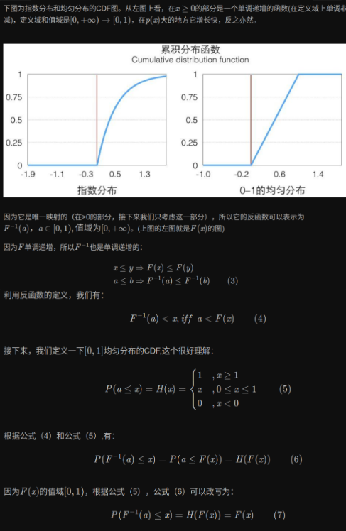
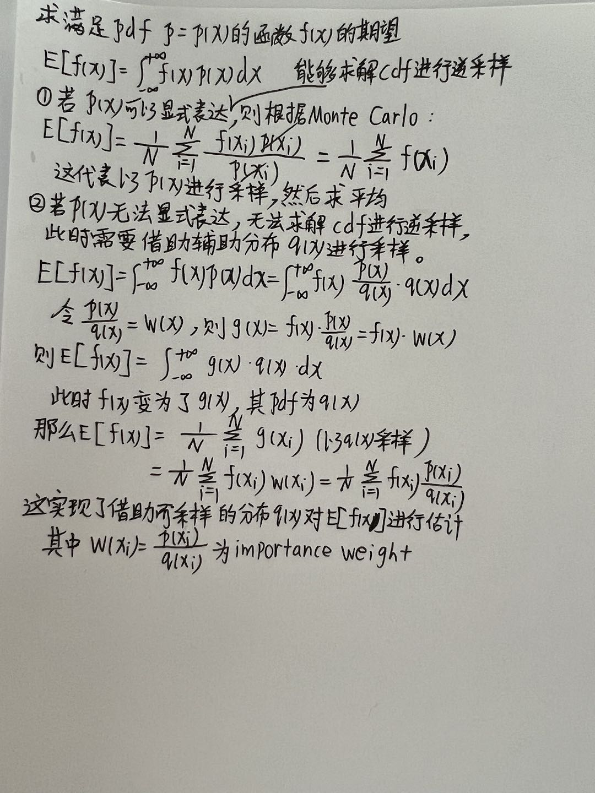
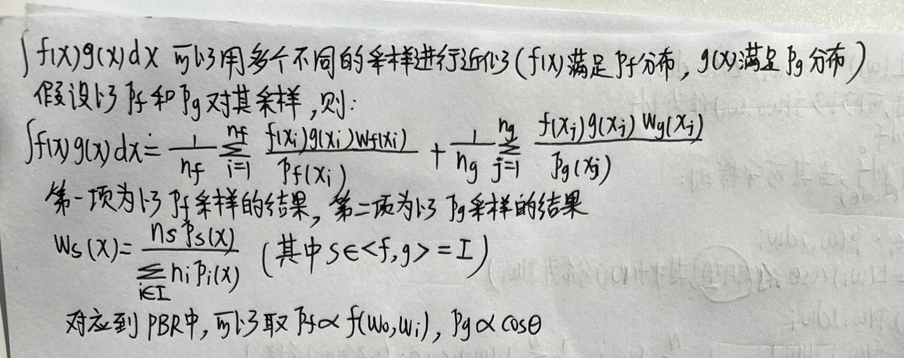
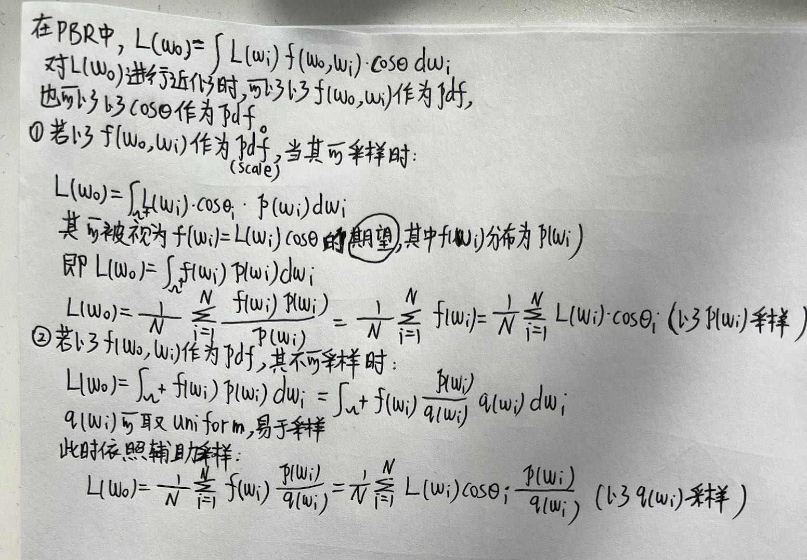
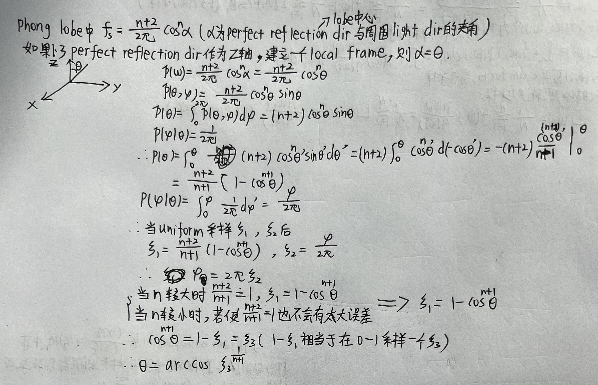
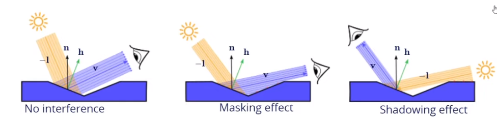

## Lumos复现

## 待思考或解决的问题
1. 数据读取部分
- [x] 弄明白hdr格式的envmap和exr格式的relit image到底怎么用，是直接转换为LDR使用还是?
  - hdr和exr存储方式和jpg、png的区别是，jpg和png存的是uint，而hdr和exr存的是float。当pixel的值位于0-1时可以采取乘以255用uint8的方式存储，但当pixel的值大于1时，无法再用uint8编码，而可以直接用hdr或者exr存取float类型的pixel value。在这个project里面，直接读取hdr格式的envmap和exr格式的portrait image，然后将它们直接以float类型输入网络train，不需要对它们做scale或者clip。
  - 如果只是为了将hdr在display上show出来，可以将读取进来的float hdr image首先进行gamma=1/2.2的compression，然后再clip到0-1并scale到0-255，存成png或者jpg来show。这是因为pixel的值控制电压进而控制屏幕亮度，若不进行gamma compression，pixel对应的值无法线性地表示亮度（pixel value扩大两倍就使得亮度变成两倍）。如果不进行gamma compression直接存成image，会导致暗的区域非常暗，亮的区域非常亮。clip是因为，display只能显示0-255，若有大于1的部分，屏幕也显示不出来。
- [ ] 研究一下怎么生成prefiltered envmap更加高效，更加接近好的效果？
- [ ] 搞明白如何从prefiltered envmap得到diffuse and specular light map。
  1. hdr envmap（image格式）怎么去围绕人，即horizontal方向上怎么去包住人。
  2. hdr envmap的radius对ray direction的方向有什么影响？当spherical envmap的radius越大时，其total area也越大，一个pixel对应的area也越大，那么当normal方向向外延伸时，在不同radius的sphere上query到的pixel可能不是同一个。
  3. diffuse light map是在prefiltered map上直接query normal方向得到的，那么specular呢，如果也是query normal方向则不符合physical model。

2. network部分
- [x] 用paper中的blur pool替换当时为了简便使用的maxpool。
- [x] paper中使用的Discriminator似乎不是patchGAN，而当时为了简便直接用的patchGAN，因此需要替换。
   *paper使用的是lsgan，即取image patch的MSEloss作为Discriminator的输出，这与patchGAN一样，因此不需要修改。*
- [ ] 几个network的activation function需要思考一下到底怎么用什么，Relu或Leacky Relu或Sigmoid。

3. loss部分
- [ ] 加上GAN loss，查看效果是否有提升。这里的GAN loss不是对整张masked image进行计算，而是对脸部区域进行crop然后对patch进行计算。
- [x] 加上VGG loss，查看效果是否有提升。这里的VGG loss并不是直接将image输入VGG然后使用其后面某一层的结果作为feature，而是取第1-5个activation function的输出算residual，然后算一个weight map去赋予不同的pixel不同的loss贡献权重，具体参考*LookinGood: Enhancing Performance Capture with Real-time Neural Re-Rendering*。
- [ ] 加上specular loss，查看效果是否有提升。

## 新的知识扩充
1. 用index去query（采样）image pixel时，如果coordinate是float类型，不要直接取整，而是利用interpolation去sample，否则可能会产生噪声，导致not smooth。（这适用于所有的sample）
2. inverse sampling
   1. 作用：从uniform分布中生成满足某个pdf分布的sample。
   2. 方法：利用uniform分布随机生成一个0-1的随机数$\xi$，$CDF(x)=\xi$，因此$x=CDF^{-1}(\xi)$，得到的x就是sample点。
   3. 推导
   
3. 从hemisphere上的pdf $p(\omega)$推导出$p(\theta, \phi)$进而利用$\theta$、$\phi$进行半球采样：

4. importance sampling
   1. 作用：对积分进行Monte Carlo采样计算时，如果单纯进行uniform采样，那么在采样数量较少时，效果会比较差。原因是，对于一个积分来说，在不同的sample point，其值大小有不同，值大的那些point对积分的贡献大，为了使得积分更准确，它们应该被更多地采样到（想象一下f(x)=正态分布pdf，如果均匀采样3个点，如果3个点都在值非常小的地方，那么蒙特卡罗计算后的积分近似值非常小，离正确的积分值误差非常大。但如果三个点都围绕在钟形的顶点周围，则用它们估算的积分值相对会更接近于正确值，误差较小）。因此采用importance sampling的目的就是使得sample时更有可能sample到value大的point，在概率上来说就是pdf大的point，这样才能更加有效地采样，在有限的sample rate内实现教好地逼近积分的近似。
   2. 原理：要实现对一个积分进行Monte Carlo近似时，尽可能地以较少的sample rate实现较高地近似程度，我们需要选择sample的pdf以承接上面的说法。一种intuitive的做法就是以整个积分作为pdf（必须对积分进行normalize使得其cdf=1），这样就满足了上述的积分值越大的sample点pdf值越大，但是直接取整个积分作为pdf时，难以以这种pdf进行采样，因此通常的做法是取积分中的某一个能够代表不同sample点大小的term作为pdf（需要normalize或称为scale使得cdf=1，亦即pdf正比于这个term），或者取多个这样的term来进行multiple importance sampling。若这样的term作为pdf易于采样（能够求解cdf的显式表达，然后以inverse sampling进行采样），则可以直接使用，若这样的pdf难以采样，则还需要另外的易于采样的分布进行辅助求解。综上，通过这样的方法，我们就可以进行importance sampling。
   3. 以辅助分布进行采样：
   
   4. multiple importance sampling：适用于积分中不同的term含有不同的分布，那么以不同分布进行采样会更准确
   
   5. 以PBR为例，简要阐述其与importance sampling和期望的联系：
   
   6. GGX importance sampling推导（通常用N作为pdf）：
   
   7. phong lobe importance sampling推导：
   
5. 对于image来说，如果直接用int去query第几个pixel，从理解上来说比较容易。但是如果需要用到float类型的index，则需要搞明白一点，若image space建一个二维坐标系，则img[0][0]这个pixel的中心为(0.5, 0.5)，而img[0][1]这个pixel的中心在(0.5, 1.5)。因此若需要用到float类型的inex（sample；这个project中利用hdr envmap生成direction），若要取到某个pixel，必须取其中心，这样才能更加准确。
6. Microfacet BRDF：用macrofacet来等效其中的无数个小的microfacet的综合效果。
   1. Normal Distribution Function D(m):
      1. 作用：其中的m代表的是Macrofacet中的microfacet的normal方向。理解为某一个macrofacet中normal方向为m的microfacet（完美镜面）的"面积"（非投影"面积"）总和。之所以加引号是因为D(m)的面积只是一个没有单位的ratio，其为其$\frac{真实面积}{macrofacet面积}$。(本来就是想以D(m)来表示normal=m的microfacet的比例，只不过这个比例用面积来表示而已)
      2. 特性
      - 在某个macrofacet中，在某个单位立体角$d\omega_m$内的normal方向为m的microfacet总面积为：
      $$
      {\rm d}A_m = D(m){\rm d}\omega_m {\rm d}A \\
      \frac{{\rm d}A_m}{{\rm d}A} = D(m){\rm d}\omega_m （即为1中所述的ratio，只不过加了个微元）
      $$
      - D(m)必须大于0: $0\leq D(m) \leq \infty$
      - 由于D(m)是非投影面积，相对与macrofacet来说，其中的所有microfacet的面积总和大于macrofacet的面积总和: 
      $$
      1 \leq \int D(m)d\omega_m \Rightarrow dA \leq \int D(m)d\omega_m dA
      $$
      - 把所有macrofacet中的microfacet的面积投影到任意方向$\vec{v}$上的投影总面积等于将macrofacet的面积投影到那个方向上得到的投影面积:
      $$
      \vec{v} \cdot \vec{n} = \int D(m)(\vec{v} \cdot \vec{m})d\omega_m \\
      \Rightarrow \vec{v} \cdot \vec{n} dA = \int D(m)(\vec{v} \cdot \vec{m})dAd\omega_m \\
      $$
      - 上一条的特殊情况为$\vec{v}=\vec{n}$，此时所有microfacet投影到macrofacet上的投影面积等于macrofacet的面积$dA$，反应在ratio上就是投影signed面积总和为1，代表为1个单位的macrofacet面积：
      $$
      1 = \int D(m)(\vec{n} \cdot \vec{m})d\omega_m \\
      \Rightarrow dA = \int D(m)(\vec{n} \cdot \vec{m})dAd\omega_m
      $$
   2. Shadowing-Masking Function $G(\vec{i}, \vec{o}, \vec{m})$
   
      1. 作用：masking代表视线方向上有物体遮挡导致看不见，shadowing代表光线方向上有物体遮挡导致光线照射不到。因此G代表着visibility，综合表示物体到光源的visibility和人眼到物体的visibility，总体表示从入射方向射入的光有多少能够被人眼看到。其跟roughness有关，roughness值越大代表macrofacet表面越粗糙，越有可能遮挡。
      2. 特性
      - 由于其代表着visibility，因此其值位于0-1之间，0代表完全看不到，1代表完全无遮挡：$0 \leq G(\vec{i}, \vec{o}, \vec{m}) \leq 1$。
      - 由于G代表的是综合特性，因此根据光路可逆性，将入射和出射方向调换，其值不变：$G(\vec{i}, \vec{o}, \vec{m}) = G(\vec{o}, \vec{i}, \vec{m})$
      - 由于macrofacet和microfacet都是有方向的面积元，因此当光线或者视线方向不在normal所在的半球内，G必然为0：
      $$
      G(\vec{i}, \vec{o}, \vec{m}) = 0 \\
      if (\vec{i} \cdot \vec{m})(\vec{i} \cdot \vec{n}) \leq 0 \\
      or for \vec{o}
      $$
      3. 结合D：上述所说D(m)是macrofacet中单位立体角内的normal方向为m的microfacet面积总和，算面积是为了进一步算irradiance进而算radiance。如果该面积元的方向在某个视线方向上不可见，也就不可能朝着视线方向辐射光线，因此我们要的是可见的面积元总面积，即visible area。D(m)只能够表示面积大小无法表示visibility，因此将G乘上D(GD)即可获得visible area。
      4. 常用表达式（Smith-GGX formulation）

      $$
      G(\mathbf{v}, \mathbf{l}, \mathbf{\alpha}) = G_1(\mathbf{l}, \mathbf{\alpha}) G_1(\mathbf{v}, \mathbf{\alpha}) \\
      G_1(\mathbf{v}, \mathbf{\alpha}) = G_{GGX}(\mathbf{v}, \mathbf{\alpha}) = \frac{2(\mathbf{n} \cdot \mathbf{v})}{\mathbf{n} \cdot \mathbf{v} + \sqrt{\alpha^2 + (1-\alpha^2)(\mathbf{n} \cdot \mathbf{v})^2}}
      $$

   3. Fresnel Function $F(\mathbf{i}, \mathbf{o}, \mathbf{m})$
      1. 解释：光线入射到一个法向为normal=**n**的表面上时，由于IOR的影响，当入射方向与normal方向不同时，被反射（完美角度）的光线的能量和被折射的光线的能量比例不同（但它们的能量总和等于入射光线），一般取air射入glass作为参照。在入射角为grazing angle时，反射的比例最大为100%，折射的比例为0%；在normal方向入射时，反射的比例最小为4%，折射的比例为96%。因此在计算反射的radiance时，需要考虑反射部分的总能量为多少，即入射能量乘以Fresnel。（Fresnel指的是反射的比例，折射的比例为1-F）
      2. Fresnel与物体颜色的关系：dielectric material（metallic=0）含有diffuse part和specular part，但是其specular reflectance是achromatic的，因此无法代表其basecolor，但是其diffuse albedo可以代表其basecolor（由于wavelength的原因，对不同通道含有不同的反射率，因此albedo是三通道量）；而对于Conductors（metallic=1），其几乎不含有或含有可忽略的diffuse分量（$f_0$三个通道的反射率接近1，那么非$f_0$几乎都是等于1），因此其只有specular reflectance，一般用其在normal方向的specular reflectance($f_0$)作为其basecolor。
      3. 常用的表达式（Schlick-fresnel）:

      $$
      F_{Schlick}(\mathbf{v}, \mathbf{h}, f_0, f_{90}) = f_0 + (f_{90}-f_0)(1 - \mathbf{v} \cdot \mathbf{h}) ^ 5
      $$

      其中$f_0$代表在normal入射方向的反射率，其为4%，$f_{90}$代表在grazing anle入射方向的反射率，其为100%。
   4. Macrosurface BSDF Integral Derivation
      1. 总原则：macrofacet朝着某个立体角辐射的power总和等于所有microfacet朝着同一个立体角辐射的power总和。
      2. 推导
      首先计算从立体角$d\omega_i$射入到macrofacet的irradiance：
      $$
      d E=L_i d \omega_i|(\mathbf{n} \cdot \mathbf{i})|
      $$
      从收到的这部分irradiance向单位立体角$d\omega_o$辐射的radiance为：
      $$
      d L_o=f_s(\mathbf{i}, \mathbf{o}, \mathbf{n}) d E
      $$
      为了获得macrofacet向单位立体角$d\omega_o$内辐射能量的irradiance（一般称为radiance exitence或exit radiance，其代表这块面积往$d\omega_o$方向辐射radiance的能力，因为radiance同磁感线一样都是往normal方向辐射的，要算其他方向的分量，必须乘上$cos\theta$；而当面积元吸收能量时，其最佳吸收方向为normal，若光线方向不为normal，必须乘上$cos\theta$），我们首先需要将radiance乘上立体角和$cos\theta$（radiance定义）：

      $$
      dL_o = \frac{d \Phi^2}{d \omega_o dA cos\theta} = \frac{d M}{d \omega_o cos\theta} \\
      \Rightarrow dM = d L_o d\omega_o |\vec{n} \cdot \vec{o}|
      $$

      上面的$cos\theta= |\vec{n} \cdot \vec{o}|$是因为同吸收能量的irradiance一样，需要算往某个方向辐射能量的irradiance。
      获得了exit radiance后再计算power：

      $$
      d\Phi = dMdA=f_s(\mathbf{i}, \mathbf{o}, \mathbf{n}) L_i |(\mathbf{n} \cdot \mathbf{i})||\vec{n} \cdot \vec{o}| d\omega_i d\omega_o dA
      $$

      为了计算所有microfacet向同样方向内辐射的power，我们首先从normal方向为m的所有microfacet开始算其辐射的power，然后对所有m方向进行积分获得总的辐射power。对某一个单位面积的microfacet（normal=m）来说，其irradiance为：

      $$
      dE_m = L_i d\omega_i |(m \cot i)|
      $$

      其往$\omega_o$方向辐射的radiance为：

      $$
      dL_{mo} = f^m_s (\mathbf{i}, \mathbf{o}, \mathbf{m}) dE_m
      $$

      其往$\omega_o$方向所在的单位立体角内辐射能量的irradiance为:

      $$
      dM_m = d L_{mo} d\omega_o |(\mathbf{m} \cdot \mathbf{o})|
      $$

      所有单位立体角$d\omega_m$内normal=m的microfacet的visible area为：

      $$
      d A_m = D(m)G(\mathbf{i}, \mathbf{o}, \mathbf{m}) d\omega_m dA
      $$

      因此该单位立体角$d\omega_m$内向$d\omega_o$辐射的power为：

      $$
      d \Phi_m = d M_m d A_m
      $$

      故所有单位立体角内（macrofacet的normal方向所在的hemisphere）的microfacet向$d\omega_o$方向辐射的总power为：

      $$
      \begin{aligned}
      d \Phi &= \int d \Phi_m d \omega_m \\
      &= \int f^m_s(\mathbf{i}, \mathbf{o}, \mathbf{m}) L_i |(\mathbf{m} \cdot \mathbf{i})| |(\mathbf{m} \cdot \mathbf{o})| D(m) G(\mathbf{i}, \mathbf{o}, \mathbf{m}) d\omega_i d\omega_o dA d\omega_m
      \end{aligned}
      $$

      根据能量相等总原则：
      $$
      f_s(\mathbf{i}, \mathbf{o}, \mathbf{n}) L_i |(\mathbf{n} \cdot \mathbf{i})||\vec{n} \cdot \vec{o}| d\omega_i d\omega_o dA = \int f^m_s(\mathbf{i}, \mathbf{o}, \mathbf{m}) L_i |(\mathbf{m} \cdot \mathbf{i})| |(\mathbf{m} \cdot \mathbf{o})| D(m) G(\mathbf{i}, \mathbf{o}, \mathbf{m}) d\omega_i d\omega_o dA d\omega_m \\ 
      \Rightarrow f_s(\mathbf{i}, \mathbf{o}, \mathbf{n}) = \int f^m_s(\mathbf{i}, \mathbf{o}, \mathbf{m}) \frac{|(\mathbf{i} \cdot \mathbf{m})|}{|(\mathbf{i} \cdot \mathbf{n})|} \frac{|(\mathbf{o} \cdot \mathbf{m})|}{|(\mathbf{o} \cdot \mathbf{n})|} D(m) G(\mathbf{i}, \mathbf{o}, \mathbf{m}) d\omega_m
      $$
      3. 
   5. Microsurface Specular BSDFs
      1. 前提：每个microfacet都是一个完美的镜面。
      2. 推导
      4中的integral中每个microfacet镜面的BSDF$f_s^m$并没有显式地表达出来，在这里，我们将其显式表达，然后带入4中的式子，最终得到BRDF表达式。

      通常的表达式为：   
      $$

      $$

   6. 
7. BlurPool：CNN不具有shift-invariant，使得微小的shift造成输出的剧烈变化，这是由于downsample时忽略了信号处理中的采样原则（需要利用低通滤波去除掉混叠的高频部分）。Blurpool能够缓解这种shift-variant，保证CNN对相同的图像内容输出的feature更加地相似，提高对图像的识别能力，也能做到anti-aliasing。

## 可调用的api
1. image space上的bilinear sample（numpy版本，torch可用grid_sample）。
2. 对hdr image在w维度上进行rotation。
3. cv2读取hdr。

## 犯过的错误
1. 不管是利用np还是torch，最好一直保持数据的dtype为float32。本次出错的地方在于，没有限制每个数据都为float32，导致获得的filtered_envmap为float64，将其存成hdr图像时，由于hdr默认格式为float32，所以不匹配，最终导致存取下来的hdr图像所有pixel值都为0，没有内容。
2. 当需要用到某个term作为pdf时，必须检查其是否大于0，检查其cdf是否为1。在这个project中，犯过的错误为直接用$cos(\theta)$作为pdf，但是其积分为$\pi$。

## 好用的工具
1. desmos：非常简易地画函数图像的工具，可以用这个工具画出函数，然后对其值有一个直观的了解，在这个project中，这个工具用于画出Fresnel-Schlick，发现其位于$\frac{\pi}{4}$内时的值非常小，可以用常数来表示。
   - 网址：https://www.desmos.com/calculator/u5unsfrcbe?lang=zh-CN
2. 