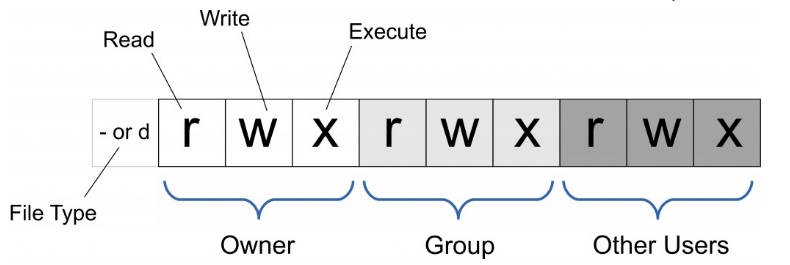
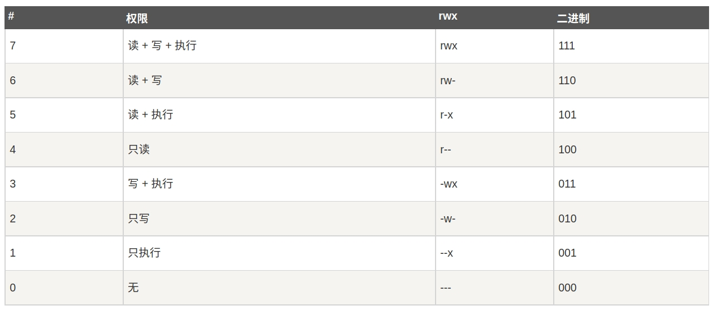
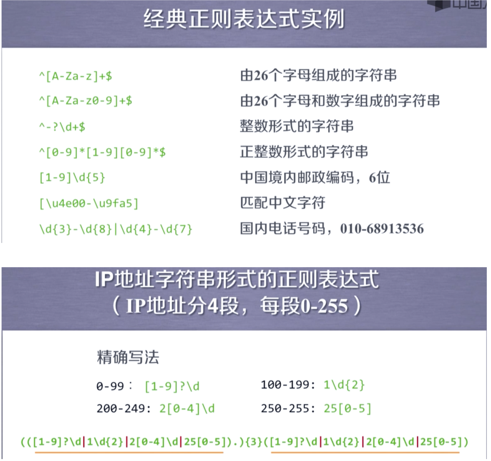
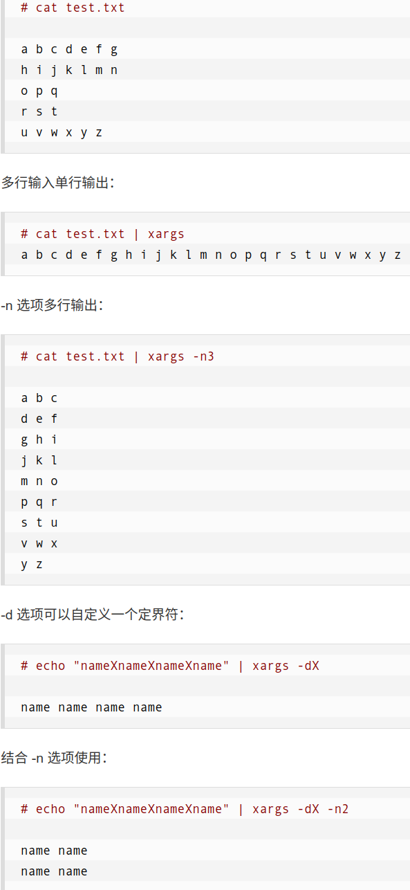

[toc]
# Ubuntu Commands

## get home dir
```shell
$HOME # means the dir of home which can be print by echo $HOME
```

## empty trash
```shell
sudo rm -rf ~/.local/share/Trash/*
```

## shell shortcuts
1. ctrl + u/k: 删除光标（cursor）前/后的所有内容
2. ctrl + a/e：将光标移动到行首、尾
3. alt + b/f：光标前/后移一个word
4. ctrl + w：删除光标前一个单词
5. ctrl + l：clear screen

## back to the last dir from current dir
```shell
cd -
```

## watch the history command and re-execute again
```shell
history # watch the history command(each command with a number)
history !n # get the commandkjjj(n is the number of the command)
```

## ```curl cheat.sh/command``` 
will give a brief "cheat sheet" with common examples of how to use a shell command.

## move files
``` shell
mv ./*.jpg ./relight
```

## grep -E = egrep
``` shell
egrep '\.MP4$|\.'
```
used for searching a string in the target string using regular expresion

## |
``` shell
ls | egrep ...
```
take the output of the last command as the input of the next command

## $

1. ```${n:-xxx}```
if $n is empty, take the one follows ":", i.e., -xxx

2. ```${n:-}```
if $n is empty, then the output is empty

## string
1. '' apostrophe

``` shell
kang='kang'
hu='hujunkang$kang'
echo $hu
```
only returns the string content itself: hujunkang$kang

2. "" double quotes
``` shell
kang='123'
hu="hujunkang$kang"
echo
```
returns the quoted one: hujunkang123

## echo 

1. echo auguments
``` shell
hu="hujunkang"
echo $hu # return the value of hu
echo ${hu} # the more safe way compared to the command in line 7
echo ${hu:n} # return the substring starting at index n
echo ${hu:m:n} # return the substring starting at index m and its length is n
```

2. ```echo $# hu```
returns the length of the argument hu


## ll = ls -l
list the information of the file (including permission)

## Modify files with specific extension under current directory
``` shell
find ./ -name "*.JPG" | awk -F "." '{print $2}' | xargs -i -t mv ./{}.JPG  ./{}.jpg
```

## Delete
1. Delete files with specific extension under current directory
``` shell
find . -name "*.ARW" |xargs rm -rfv
find . -name "a*" |xargs rm -rfv
```
2. delete files with specific format
``` shell
ls | egrep "DSC0\d{4}.ARW" | xargs rm
```

## count the files under the directory
``` shell
ls | wc -l
```

## modify file names
``` shell
i=100000001; for f in *.JPG; do mv "$f" ${i#1}.jpg; ((i++)); done
```

## 建立软链接
``` shell
ln -s source target
```
例如source为/dellnas/dataset/static_recon/Relight/junkangs/head_1118/（这个“/”不能缺，代表将整个head_1118文件夹转移到某个路径下）, target为/dellnas/home/hujunkang/data/（data这个文件夹必须存在，head_1118文件夹将会软链接到data文件夹下，名称为head_1118）。

## 改变权限命令chmod

1. 基本格式 
```shell
chmod [-x] 权限命令 filename(dir name)
```
2. -x代表可选参数，一般使用的时候只考虑-R（代表对directory操作），如果不写就是对某个file操作
3. 权限命令
   1. 用数字指定：一共三位数字，每位数字分别代表user、group、others的权限。可以根据二进制得出数字，如777代表对user、group、others都服务rwx权限。
   
   2. 用字母指定:
      1. u,g,o,a：分别代表user、group、others、all
      2. +-=：分别代表增加某个权限，减去某个权限，设置权限为
      3. 结合起来就是如：ug+r, a+r, ugo-r等
4. example：
``` shell
chmod -R 777 dir1 # 对user、group、others关于某个路径的权限都设置为rwx
chmod ugo+r file1.txt / chmod a+r file1.txt # 设置文件为所有人都可读
chmod ug+w,o-w file1.txt file2.txt # ug加上写的权限，o减去写的权限
chmod -R a+r * # 对当前路径下所有的文件进行递归增加所有人读的权限
chmod a=rwx file # 设置所有人对file有rwx权限
chmod ug=rwx,o=x file # 设置ug权限为rwx，o权限为x

```

## 搜索文本命令grep
一、正则表达式（regular expression）
1. 语法：
   1. 由字符和操作符组成
   2. 操作符：
      note：当以下⼀些字符如’.’、’+’需要以其本来字符形状出现时，需要在其前⾯加⼀个’\’来转义，可以进⼀步认为，所有的字符若要以其本来意思出现时，都需要在其前⾯加⼀个反斜杠。
      1. .：表示任何单个字符
      2. [ ]：字符集，对单个字符给出取值范围。[abc]表示a、b、c中的⼀个字符；[a-z]表示a-z单个字符。
      3. [^]：⾮字符集。[^abc]代表单个字符，其⾮a、b、c。
      4. \*：表示“\*”前⼀个字符的0次或⽆限次扩展。如abc\*代表ab（0次），abc（1次），abcc（2次）等
      5. +：表示“+”前⼀个字符出现1次或⽆限次扩展。
      6. ？：表示“？”前⼀个字符0次或1次扩展
      7. ｜：表示“｜”左右表达式任取其⼀。abc｜def表示abc或def
      8. {m}：表示扩展“{}”前的那个字符m次。ab{2}c代表abbc
      9. {m, n}：表示扩展“{}”前的那个字符m-n次（包含m、n），{:3}代表0次⾄3次。ab{1, 2}c代表abc、abbc
      10. ^：相对于3未出现在“[]”中表示匹配⼀个字符串的开头。^abc代表身处⼀个字符串开头的“abc”字符串
      11. $：匹配字符串结尾。abc$代表身处⼀个字符串结尾的“abc”字符串
      12. ()：分组标记，内部只能使⽤“｜”。（abc）表示“abc”；（abc｜def）表示“abc”或“def”
      13. \d：数字。等价于[0-9]。但是\d{3}代表的不是某⼀个数字重复3次，⽽是代表有连着的3个数字。
      14. \w：单词字符。等价于[A-Za-z0-9_（下划线）]
      note：当上⾯所述的*、+、？没有搭配具体的字符（如abc+）使⽤时，⽽是如[abc]+或[a-z]+或\d{3}这样出现时，代表的是括号中的任意单个字符的组合。
2. example


二、grep语法
1. asdf 


## 命令传参xargs
1. 默认setting
   1. xargs默认与管道搭配使用，即```xxx | xargs ...```，但是也可以接受用户的输入。
   2. xargs默认的命令是echo，即若不指定执行的命令，默认执行echo。
   3. xargs默认一次性接收前置命令的所有内容。
   4. 输入xargs的内容可能包含space和换行，但是在xargs里面都会被转换成space。
2. 读取某个文件，然后以指定格式输出

   1. 当没有-n时，默认一下子读取所有的内容（由于setting的第4点，所以读取进来的内容本来可能含有space和换行，但是最后都被转换为space并输出）。
   2. 当-n指定每次读取多少个以space分隔的内容后，每次只读取几个参数，次与次之间以换行分隔并打印。
   3. setting默认以space或换行符分隔内容，但是可以以-d指定分隔符，使输入的内容以指定的分隔符分为，以space分隔的内容。
3. -I可以将xargs接受的输入传递给后一命令
```shell
ls *.jpg | xargs -n1 -I {} cp {} /data/images 
cat foo.txt | xargs -I file sh -c 'echo file; mkdir file'
# 
```
   1. -I代表将前一个命令输入到xargs中的内容替换到xargs后的命令当中（当xargs后的命令为mkdir这种只需要一个输入的情况时用不到-I(xxx|xargs mkdir即可)；但是cp这种命令后续有两个参数，为了指定传参的位置，必须要用-I来指定传参位置）
   2. {}配合-I使用，将xargs接受的参数传入到后续命令当中
   3. 当xargs后有多个命令同时执行时，需要用某个变量名（上面为“file”）而不是{}。
4. -p 和 -t
-p即为print，代表每次执行命令前打印要执行的命令并询问一下用户是否执行（用户输入yes才会执行）；-t在打印要执行的命令后直接执行，不需要用户输入。
5. 使用 -0配合find命令使用
   1. xargs默认以space作为分隔符，这使得它无法处理一下文件名，因为文件名中可能包含一些空格。一般的文件名都通过find来获得，这时可以配合find一起使用，以专门处理文件名。find命令中的“-print0”可以将获得的文件名以“\0”（即null）分隔，这保证了文件名中的space仍然存在。而在xargs中可以指定以null为分隔符而不是space，以处理这种文件名中有space的情况。
   ![-0]
   ```shell
   find /path -type f -print0 | xargs -0 rm
   ```
6. 

## 搜索进程和杀死进程：pgrep & pkill & kill
1. ```pgrep [option] pname```
   1. ``` shell
      pgrep ssh # 显示以ssh为名称的各个进程的pID
      pgrep -l ssh # 同时显示以ssh为名称的各个进程的pID和进程名称
      pgrep -o ssh # 当匹配多个进程时，显示进程号最小的那个进程
      pgrep -n ssh # 当匹配多个进程时，显示进程好最大的那个进程
      pgrep -f "python main.py" # 找到正在执行某一命令的进程的pid
      ```
2. kill命令（会向指定id的进程发送信号，如终止、杀死等信号）
   1. ``` shell
      kill -l # 列出所有可以发送的信号
      kill -l KILL # 显示KILL信号对应的简化的数值（KILL=9）
      kill -KILL 12345 = kill -9 12345 # 杀死指定pid的进程
      kill -9 %n # 杀死当前shell中id为n的进程
      ```
3. pkill命令（可以以进程名称来处理整个进程组）
   1. ``` shell
      pkill -o ssh # 杀死以ssh为名称的进程组中进程id最小的进程
      pkill -n ssh # 杀死以ssh为名称的进程组中进程id最大的进程
      pkill -9 ssh # 杀死以ssh为名称的整个进程组
      pkill -u mark # 杀死制定user（mark）的所有进程
      pkill -u mark，hank # 杀死多个user的所有进程
      pkill -9 -u mark ssh # 强制杀死user（mark）的以ssh为名称的整个进程组
      pkill -9 -f "ping 8.8.8.8" # 强制杀死明确带有auguments的命令产生的进程（shell执行ping 8.8.8.8会产生一个进程去处理，我们要杀死这个进程）
      ```
4. 加```-KILL或-9```与不加的区别：不加会正常中断进程，然后一步步将其kill（较为安全）。加了之后直接不讲道理杀死，没有正常中断的过程。一般先用不加```-KILL```，如果无效就使用它，可以理解为不加```-KILL```就是正常关闭软件，加了相当于在任务管理器界面强制终止进程。

## 进程的后台运行、suspend、continue等
1. ```jobs [args]```
   1. 作用：显示在当前shell下产生的进程（running、suspend or terminating）。
   2. 直接调用```jobs```只显示进程在当前shell中的序号和进程运行的命令，但是不显示进程的pid。使用```jobs -l```可以显示pid。
2. ```disown [agrs] [pid | %{当前shell中的进程序号}]``` 
   1. args中-a代表移除当前shell中的所有作业，-r代表移除运行中的作业。使用-a或者-r后不需要指定后面的pid或者在当前shell中的进程序号**注意：移除只是代表不被当前shell看到，即使用*jobs*命令无法看到移除的进程，但是这些进程还在后台运行。**
   2. ```shell
      jobs -l # 查看当前shell中的进程及其id和pid
      disown %n # 使用通过jobs查看的id移除进程
      disown pid # 使用通过jobs查看的pid移除进程
      ```
3. ```nohup command [&]```：
   1. 作用：nohup命令用于运行程序或者命令，并忽略所有中断信号SIGHUP。SIGHUP是当前shell关闭时发送到进程的信号。
   2. ```shell
      nohup ./clash -d . & # &用于将命令放到后台运行，不在shell显示
      nohup /root/runoob.sh > runoob.log 2>&1 & # nohup命令执行后shell不会有输出，如果想把输出存下来，可以使用当前命令将所有的输出或者错误都存放到runoob.log（可以自己指定）中
      ```
   3. 在2中加&可以把进程放到后台运行，但是由于nohup命令不会在关闭shell后终止进程的运行，因此即使不加&而进程仍在运行时关闭shell，进程仍可以在后台找到。
   4. 使用nohup后shell的本来的输出会放到当前目录下的*nohup.out*文件中。
   5. 与disown的关联和区别：在disown中，通过disown移除进程后，进程也会在后台运行，但是无法在当前shell中通过jobs命令查看；而nohup虽然能够保持进程在后台的持续运行，但是仍能够在当前shell中通过jobs命令查看。因此为了保证进程在后台的永久运行，要么直接使用disown，要么使用nohup后使用disown清理在此shell中可查看到的进程，要么使用nohup后直接关闭shell。
4. 进程的挂起和终止：
   1. 前台挂起和终止进程：*ctrl+z*是suspend进程，*ctrl+c*是终止进程。进程的挂起只在当前shell有效，只要关闭当前shell，进程就会消失，不存在与后台之中。**前台进程的终止用ctrl+c，后台进程的终止用kill；前台进程的挂起用ctrl+z，后台进程的挂起用kill -stop [pid | %{当前shell进程id}]**
5. ```fg bg```
   1. ```shell
      ./clash -d . # 运行命令然后使用ctrl+z将其suspend
      jobs -l # 查看当前shell中的进程信息
      fg %n # 恢复被suspend的进程到前台运行 | 将后台运行的某个进程换到前台运行。若想将前台运行的进程换到后台运行，则先用ctrl+z将其suspend，然后使用bg将其放在后台运行。
      bg %n # 恢复被suspend的进程到后台运行
      ```
   2. 注意：没有disown和nohup命令，这些进程都只在当前shell中运行，关闭当前shell后，shell会向进程发送Sighup信号，kill这些进程。也即，bg和fg只能操纵当前shell中的进程而不能操纵后台进程。
6. ```&```：将&加到command的最后可以使command在后台运行，若有些command搭配&运行后仍占用前台，即使用ctrl+c终止进程，仍可以在jobs或者后台看到这个进程。
```shell
./clash -d . &
ctrl + c # 执行完ctrl+c后仍可以看到进程在运行
```

## 复制、粘贴文本中的内容到clipboard（用于复制记录的git token或者公钥）
1. mac
```shell
pbcopy < ~/.ssh/id_rsa.pub
echo `pbpaste` # 若要在shell中打印内容，可以用pbpaste
```
2. windows
```shell
clip < ~/.ssh/id_rsa.pub
```
3. linux
```shell
sudo apt-get install xclip
xclip -sel clip < ~/.ssh/id_rsa.pub
# Copies the contents of the id_rsa.pub file to your clipboard
```
4. 将linux中的xclip命令换为pbcopy
在~/.zshrc中加入以下内容：
```shell
alias pbcopy='xclip -selection clipboard'
alias pbpaste='xclip -selection clipboard -o'
```
5. 解决pbcopy命令会在paste时多出一个换行符的几种方法
``` shell
printf $(pwd) | pbcopy # 1
echo -n $(pwd) | pbcopy # 2
echo -n "$(pwd)" | pbcopy # 3（如果目录名称中包含空格字符用3，否则用2）
echo "abcd\c" | pbcopy # 如果直接在shell中手动输入要copy的内容，可以在内容后面加上\c
```