# 切割uv的流程

## 1. 利用meshlab或cloud compare切割掉明显不合理的mesh区域
### cloud compare
1. 下载地址：https://www.danielgm.net/cc/release/
2. import mesh然后利用bounding box裁剪mesh：（点击下图的Cross Selection来调用bounding box）：
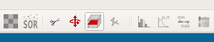
3. 移动箭头缩小bounding box：
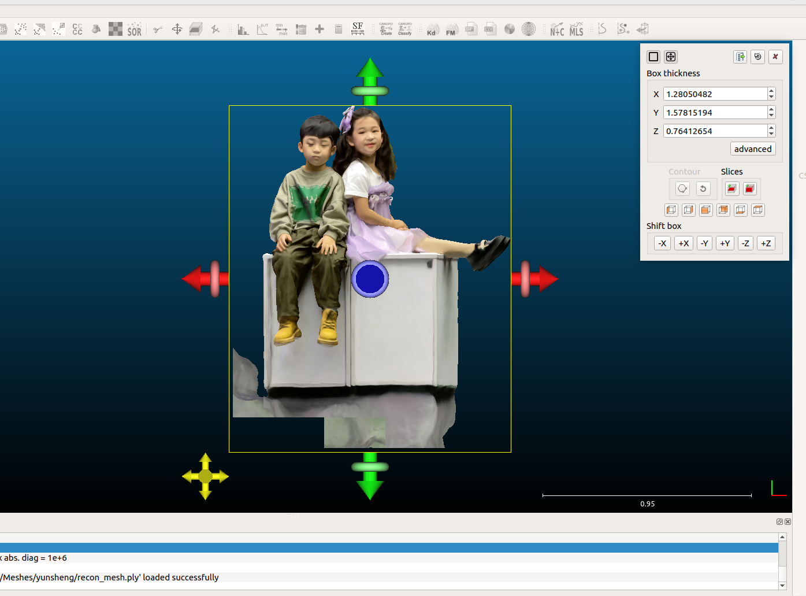
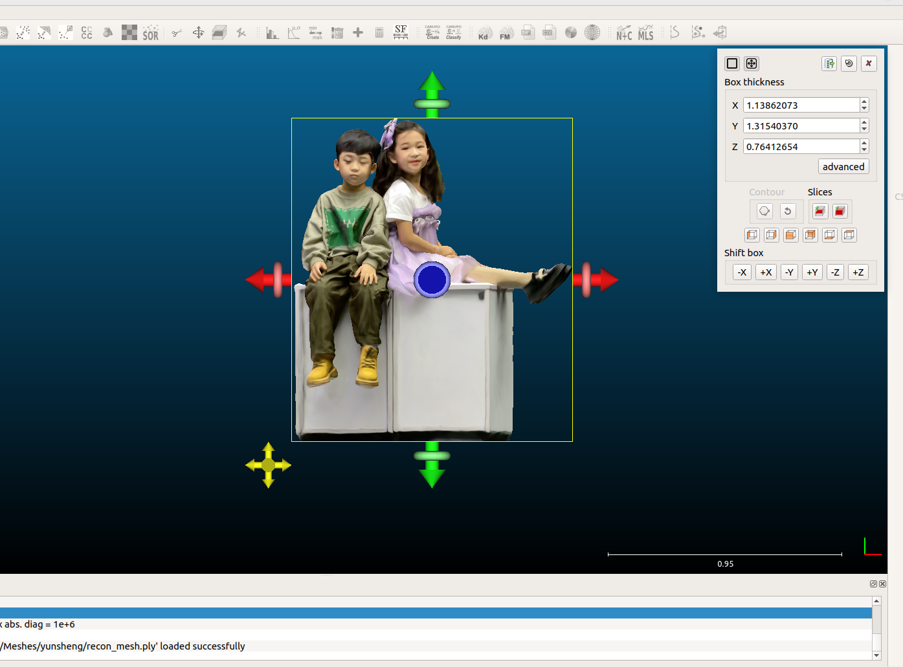
4. 然后进行切割，点击下图Slices模块里左边那个按钮
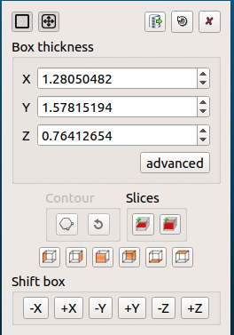
5. 最后点击菜单栏中的"export selection as a new cloud"将mesh导出。按钮如下：
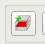

## 2. 然后再用meshlab切掉non-manifold vertices 和 edges

### 怎么看是否有non-manifold vertices or edges？
1. 将下图中的No-Manif Verts和No-manif Edges切换为“on”
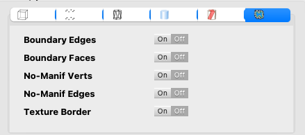
2. 即可在meshlab左上角出现下图的标示
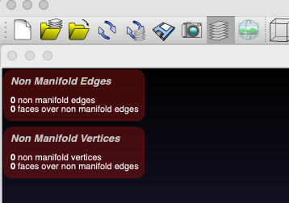
3. 若non-manifold vertices and edges的数量都为0则不用做后续操作，否则在搜索框搜索"manifold"如下图：
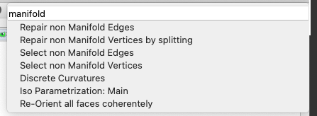
4. 选择第一个和第二个，出现对话框直接点击apply即可

## 3. 然后利用meshlab降面
1. 选择Filters->Remeshing, Simplification and Reconstruction->Simplification:Quadric Edge collapse Decimation
2. 将下图的勾选中即可，其他不用改，点击apply即可降面
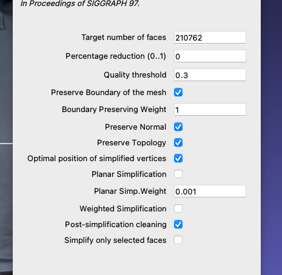
3. 降面每次最好按照系统的setting降一半的faces，如果还需要再降，则重复第一步和第二步

## 4. 将mesh export后再用blender打开

## 5. 打开后选择"Edit Mode"
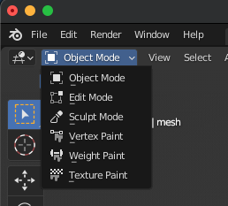

## 6. "Select Mode"选择分别选择vertex、Edge、Face执行切割非连通分量操作（为了去除非object的内容）
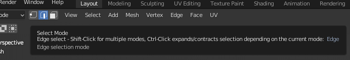

具体操作如下：
1. 鼠标放到object上，点击L键以选择当前的连通分量，然后点击Ctrl+I，以选择当前选中连通分量外的所有其他分量，然后执行Delete
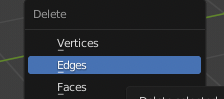
2. 注意，delete时，若当前选择的是vertex模式就delete vertex，对edge和face同。
3. 至此，所有其他的噪声全部去除完毕，可以进行uv展开

## 7. 选择Edit Mode的Edge模式，在mesh上任意一处用鼠标点击一下即可选择seam的起始点，然后按住ctrl再点击另一处即可形成一条seam。当前选中的Seam只作为编辑，还未真正画上去，需要将seam标记上去。如图。此外若想去除seam，也可以选中seam，然后点下图中的clear seam。
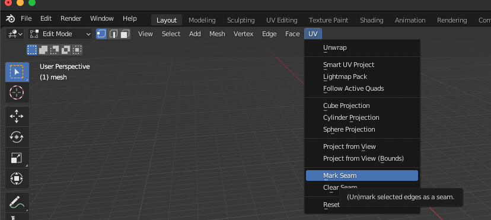

## 8. 画完所有seam之后点击下图的unwrap即可uv展开
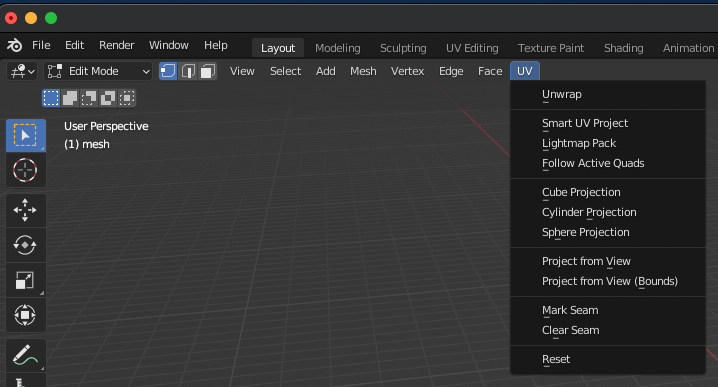
点击菜单栏的uv editing即可查看展开后的内容。

## 9. 尽量确保展开后的uv图较为均匀地分布在uv平面上
1. 将鼠标放在某个面上，点按L键选中某块uv图。
2. 用G键可以移动uv图，用R键可以旋转uv图，用S键可以scale uv图。

**Note：**
1. 做完第6步后，必须仔细检查一下mesh上是否有洞，若有洞会出错。洞如下图所示
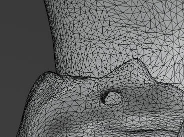
2. 若blender读取和导出的是obj类型的mesh时，必须确保axis align（y forward；z up；keep vertices order）
3. 在仔细检查mesh时，除了要找到第1步中的hole，还要仔细观察是否有某些region的mesh扭曲过大，比如折叠角度特别大的区域。当遇到这种区域时，最好在这些区域多切一刀，否则自动展开时，这些极度扭曲的区域在uv平面上占据的空间非常小，即mesh上的一大块区域可能被映射到uv平面上近乎一个点的区域。